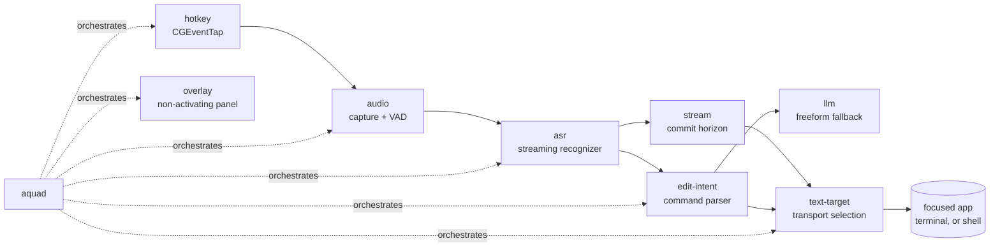

# Aqua OSS

A fully local, open-source alternative to [Aqua Voice](https://withaqua.com):
hold a key, speak, and text appears in whatever you are typing into. Select
text, speak a change, and it is rewritten in place.

Nothing leaves your machine.

**Status: working prototype.** Dictation, edit-by-voice, and shell command-line
editing are verified end to end on macOS. Windows and Linux backends are
designed and stubbed but not implemented. See [what works](#what-works-today).

## Why this exists

Aqua Voice and [Wispr Flow](https://wisprflow.ai) are excellent and are both
cloud products: your audio leaves your device, transcripts are retained unless
you opt out, and there is no offline mode. The open-source alternatives
([Handy](https://github.com/cjpais/Handy),
[VoiceInk](https://github.com/Beingpax/VoiceInk), Whispering) are local but stop
at dictation. None of them can edit text you have already written.

Three things here are, as far as we can tell, not available anywhere else in
open source:

1. **Edit-by-voice.** Select a sentence, say "change hello to goodbye", and it
   is rewritten in place through the accessibility API, preserving the host
   application's undo where possible.
2. **Terminal and shell support.** A terminal exposes no writable accessibility
   field, so we cooperate with the line editor directly. You can rewrite a
   `kubectl` command by voice, and `^Xu` undoes it through zsh's own undo.
3. **Headless operation.** A build with no display libraries linked at all, for
   SSH sessions and servers.

It is also faster. Measured end to end on an M4 Pro: **131-189ms** from key
release to text on screen, against Aqua's advertised ~450ms insert latency.

## What works today

Every number below was measured on this machine, not estimated.

| Path | Result | Latency |
|---|---|---|
| Dictation into a native app | "The rain in Spain falls mainly on the plain." | 189ms |
| Edit-by-voice on a selection | "quick" → "slow", in place | 131ms |
| Shell command line | `--namespace prod-web` → `staging-web`, zsh undo intact | verified |
| Clipboard fallback (unfocused) | text still delivered | 445ms |

Recognition is Apple's on-device `SpeechTranscriber` (macOS 26+), which needs no
model download. Parakeet TDT and whisper.cpp backends are stubbed with
documented model URLs for platforms without it.

Not yet built: Windows and Linux transports, streaming partial injection wired
into the daemon, and a settings UI. See [`docs/planning/00-roadmap.md`](docs/planning/00-roadmap.md).

## Install

Requires macOS 13 or newer (26+ for the zero-install recognizer) and a Rust
toolchain. Windows and Linux do not work yet.

```bash
git clone https://github.com/blarer/aqua-oss
cd aqua-oss
cargo build --release

# Package as a .app and grant Accessibility permission. Both steps matter:
# reading and rewriting text in other applications is exactly what that
# permission governs, and macOS attaches the grant to a signed bundle rather
# than to a bare binary.
./scripts/bundle-macos.sh
./scripts/grant-accessibility.sh
```

If anything misbehaves, run the doctor before anything else. Almost every
failure in this category is environmental rather than a bug, and each check
names the exact next action:

```bash
./scripts/doctor.sh
```

## Using it

### Dictating

Start the daemon and leave it running:

```bash
cargo run --release -p aquad
```

Then, in any application:

1. Put your cursor where you want text.
2. **Hold right-option.** The overlay appears.
3. Speak.
4. **Release.** Your words appear at the cursor.

To try it without a microphone, feed it synthesized speech:

```bash
cargo run --release -p aquad -- --once --say "hello from a local dictation daemon"
```

### Editing text you already wrote

This is the part other dictation tools do not do.

1. **Select some text** in any application.
2. **Hold right-option** and speak a command.
3. **Release.** The selection is rewritten in place.

Commands are matched literally, so they are predictable rather than clever:

| Say | Effect |
|---|---|
| "change *X* to *Y*" | replaces every *X* with *Y* |
| "replace *X* with *Y*" | same |
| "make *X* into *Y*" | same |
| "swap *X* for *Y*" | same |
| "delete *X*" | removes *X* |
| "remove *X*" / "get rid of *X*" / "scratch *X*" | same |
| "add *X*" / "append *X*" | appends *X* |
| "all caps" / "uppercase" | THE WHOLE SELECTION |
| "lowercase" | the whole selection |
| "title case" | The Whole Selection |
| "sentence case" | The whole selection |

Matching ignores case, because speech recognition will not reproduce the casing
on your screen. If nothing matches, you are told so rather than having the text
silently changed.

Anything that is not one of the above ("tighten this up", "make it more
formal") is a *freeform* edit and needs the local language model, which is
built but not yet wired into the daemon. Today the daemon says so instead of
doing nothing.

### Editing a shell command line

A terminal exposes no writable text field to the accessibility API, so this
works by cooperating with your shell's line editor directly.

```bash
# Install the plugin for your shell. It appends one guarded line to your rc
# file and composes with oh-my-zsh and friends.
cargo run --release -p shell-bridge -- install

# Run the bridge alongside the daemon.
cargo run --release -p shell-bridge -- serve
```

Then, at a prompt:

1. Type a command but **do not run it**.
2. Speak an edit (same commands as above).
3. Press **Ctrl-X Ctrl-A**. The command line rewrites in place.
4. **Ctrl-X u** undoes it, through your shell's own undo.

```
$ kubectl get pods --namespace prod-web --output wide
                       say: "change prod-web to staging-web", then ^X^A
$ kubectl get pods --namespace staging-web --output wide
```

Bash and fish are supported too. The bridge never executes anything: the
protocol has no execution verb at all, and a rewritten line always waits for
you to press enter.

### Useful flags

```
--once           run one dictation cycle and exit
--say TEXT       synthesize TEXT with `say` instead of using the microphone
--wav FILE       feed a WAV file instead of the microphone
--chord CHORD    change the hotkey (default: right-option)
--asr apple|mock choose the recognizer
--no-overlay     log state changes instead of drawing the panel
--realtime       pace file audio like live speech
```

Hotkeys are written the way you would say them: `right-option`, `fn`,
`cmd+shift+space`. Conflicts with existing system shortcuts are detected and
reported rather than silently failing.

## How it fits together



| Crate | Responsibility |
|---|---|
| `aquad` | The daemon. Wires everything together and owns the state machine |
| `audio` | Capture, ring buffer, resampling, VAD, speech segmentation |
| `asr` | Streaming recognizer trait, Apple/Parakeet/whisper backends, model manager |
| `stream` | Commit horizon, minimal diffs, coalescing, undo ring |
| `edit-intent` | Spoken command → deterministic text transformation |
| `llm` | Local model for freeform edits, with guardrails and preview |
| `text-target` | Picks and drives a transport for any destination |
| `ax-edit` | macOS accessibility read/rewrite |
| `shell-bridge` | Unix socket + shell plugins for command-line editing |
| `hotkey` | Global push-to-talk, tap-to-latch, conflict detection |
| `overlay` | Non-activating floating panel |
| `config` | Layered configuration, per-app profiles, vocabulary |
| `diag` | Environmental checks, timing, redacted bug reports |
| `spike-cli` | Development harness for the accessibility layer |

## Design decisions worth knowing

**A language model is the fallback, not the first resort.** Most edit commands
are a small closed set: replace, delete, append, recase. A deterministic parser
handles them in microseconds with no GPU and no chance of a model rewriting text
nobody asked it to touch. Only open-ended instructions escalate to a local model,
and those are previewed before they apply.

**The overlay must never take focus.** Taking focus would destroy the text field
we are about to edit, so this is a correctness requirement rather than polish.
It is a non-activating `NSPanel` that cannot become key.

**Committed text is never retracted.** A streaming recognizer revises itself:
"recognise speech" can become "wreck a nice beach" three words later. Text is
only committed once several consecutive hypotheses agree on it, so the user
never watches their document rewrite itself.

**Transports are chosen by capability, not by guesswork.** Selection is a pure
function of an `Env` trait, so every branch is unit tested rather than only
reachable on a machine that happens to have that software installed.

**Headless is a compile-time gate.** Building without the `display` feature drops
the GUI dependencies entirely, so a display library reaching the default feature
set is a compile error rather than a runtime crash on a server.

## Documentation

| Document | Read it when |
|---|---|
| [`docs/M0-results.md`](docs/M0-results.md) | You want the measured result and what it cost |
| [`docs/latency.md`](docs/latency.md) | You care where the milliseconds go |
| [`docs/macos-permissions.md`](docs/macos-permissions.md) | Anything permission-shaped is behaving strangely |
| [`docs/debugging.md`](docs/debugging.md) | Something works in one application and not another |
| [`docs/compat-matrix.md`](docs/compat-matrix.md) | You need to know what a destination supports |
| [`docs/shell-integration.md`](docs/shell-integration.md) | You are working on terminal support |
| [`docs/streaming.md`](docs/streaming.md) | You are touching partial text commitment |
| [`docs/configuration.md`](docs/configuration.md) | You are adding or changing a setting |
| [`docs/signing-runbook.md`](docs/signing-runbook.md) | Certificates, or why grants keep dying |
| [`docs/ux/`](docs/ux/) | You are designing user-facing behaviour |
| [`docs/planning/`](docs/planning/) | You are picking up work or planning a milestone |
| [`CONTRIBUTING.md`](CONTRIBUTING.md) | You are about to write code here |

## Four traps that will cost you a day each

These were all discovered the hard way. They are why `doctor` exists.

1. **The system-wide `AXUIElement` does not work.** Asking it for
   `AXFocusedUIElement` returns `kAXErrorCannotComplete` even for a fully
   trusted process. Resolve the focused *application* first, then ask it.
2. **Accessibility grants follow the responsible process.** A binary run from a
   shell is judged against your terminal's permission, so the app can appear
   enabled in System Settings and still be denied. Launch through
   LaunchServices.
3. **Ad-hoc signatures invalidate grants on rebuild.** TCC pins approval to the
   binary's `cdhash`. The toggle keeps reading "on" while nothing works. Use
   `tccutil reset` during development, and a Developer ID certificate for real.
4. **Windows hang off `AXWindows`, not `AXChildren`.** An application element's
   children are its menu bar.

## Testing

```bash
cargo test --workspace          # 400 tests, no permissions needed
./scripts/doctor.sh             # environmental checks
./scripts/test-real-apps.sh     # drives TextEdit and Safari, skips cleanly if absent
./scripts/verify-shell-bridge.sh # rewrites a command line in a real zsh
./scripts/bench-latency.sh      # criterion benchmarks against live applications
cargo bench -p ax-edit --bench gate  # latency regression gate
```

The fuzz suite found a real panic and a silent over-edit within minutes of being
written, which is the entire argument for having it.

## Licence

MIT for all code. Model weights carry their own licences and are documented
separately in [`docs/asr-integration.md`](docs/asr-integration.md) and
[`docs/llm.md`](docs/llm.md).
