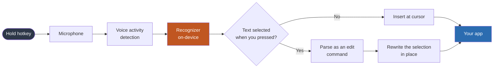
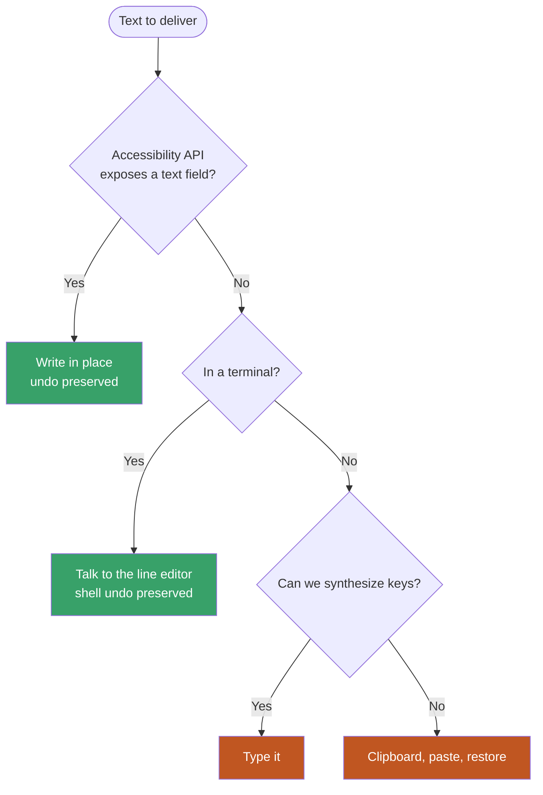
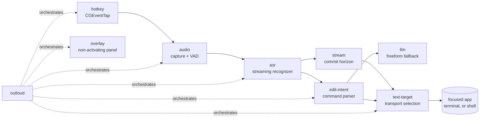

<div align="center">


# OutLoud

**Talk to your computer. The words land where you are already typing.**

</div>

Hold a key, speak, and text appears in whatever you are typing into. Select
text, speak a change, and it is rewritten in place.

Your audio never leaves your machine.

**Open-source software, proprietary model.** Every line of this project is MIT
licensed and auditable. The speech recognition it currently depends on is
Apple's on-device `SpeechTranscriber`, whose weights are Apple's and closed.
That is a real limitation and it is stated here rather than in a footnote:

- The recognizer runs **on your device**, so "nothing leaves your machine"
  holds. It is local, and it is not open.
- It requires **macOS 26 or newer**. On macOS 13-25 the app installs, runs, and
  shows its menu bar icon, but **cannot transcribe a word**.
- The open-weights backends (Parakeet TDT, whisper.cpp) are **stubs**, not
  implementations. Until one lands, there is no fully-open path end to end, and
  no working recognizer on Windows or Linux at all.

If a fully open stack is what you need today, this is not yet that. It is the
rest of the machine built around one, and the recognizer is a seam designed to
be swapped ([`crates/asr`](crates/asr)).

**Status: working prototype.** Dictation, edit-by-voice, and shell command-line
editing are verified end to end on macOS. Windows backends (UI Automation,
keyboard hook, layered overlay) are implemented and compile in CI on real
Windows runners, but have not been exercised on Windows hardware. Linux is
still designed and stubbed. See [what works](#what-works-today).

## How it works



The orange step is the only closed component. Everything else is in this repo.

Text is delivered through whichever transport the focused application actually
supports, best first, falling back until something works:



Green paths can *read* the existing text, which is what makes edit-by-voice
possible. Orange paths are insert-only: dictation works, editing does not.
Why each tier exists, and which applications land in which, is in
[`docs/compat-matrix.md`](docs/compat-matrix.md).

## Why this exists

Aqua Voice and [Wispr Flow](https://wisprflow.ai) are excellent and are both
cloud products: your audio leaves your device, transcripts are retained unless
you opt out, and there is no offline mode. The open-source alternatives
([Handy](https://github.com/cjpais/Handy),
[VoiceInk](https://github.com/Beingpax/VoiceInk), Whispering) are local but stop
at dictation. None of them can edit text you have already written.

Three things here are, as far as we can tell, not available anywhere else in
open source:

1. **Edit-by-voice.** Select a sentence, say "change hello to goodbye", and it
   is rewritten in place through the accessibility API, preserving the host
   application's undo where possible.
2. **Terminal and shell support.** A terminal exposes no writable accessibility
   field, so we cooperate with the line editor directly. You can rewrite a
   `kubectl` command by voice, and `^Xu` undoes it through zsh's own undo.
3. **Headless operation.** A build with no display libraries linked at all, for
   SSH sessions and servers.

It is also faster. Measured end to end on an M4 Pro: **131-215ms** from key
release to text on screen, against Aqua Voice's advertised ~450ms insert
latency. The spread is real and depends on the transport: an accessibility
write into a native field is the fast end, synthesized keys into a terminal the
slow end.

## What works today

Every number below was measured on this machine, not estimated.

| Path | Result | Latency |
|---|---|---|
| Dictation into a native app | "The rain in Spain falls mainly on the plain." | 189ms |
| Edit-by-voice on a selection | "quick" → "slow", in place | 131ms |
| Shell command line | `--namespace prod-web` → `staging-web`, zsh undo intact | verified |
| Clipboard fallback (unfocused) | text still delivered | 445ms |

Recognition is Apple's on-device `SpeechTranscriber` (macOS 26+), which needs no
model download and whose weights are Apple's, not ours. Parakeet TDT and
whisper.cpp backends are **stubbed, not implemented**: the files exist with a
documented integration plan and model URLs, and they return an error if you
select them. Implementing one is the single highest-value contribution
available here, because it is what would make the stack open end to end and
give Windows and Linux a working recognizer.

Not yet built: Linux transports, a Windows shell integration (the unix-socket
bridge needs a named-pipe plus PSReadLine equivalent), streaming partial
injection wired into the daemon, and a settings UI. See
[`docs/planning/00-roadmap.md`](docs/planning/00-roadmap.md).

### Windows status, precisely

Every Windows backend is implemented and compiles on real `windows-2025` CI
runners for both x86_64 and aarch64; none has been *run* on Windows hardware,
because CI compiles but cannot exercise GUI or input code. Treat it as
untested, not as unwritten:

| Piece | Mechanism | State |
|---|---|---|
| Hotkey | `WH_KEYBOARD_LL` hook, `RegisterHotKey` conflict probe | implemented, untested on hardware |
| Read + in-place write | UI Automation `TextPattern` / `ValuePattern` | implemented, no undo preservation (needs TSF) |
| Typing fallback | `SendInput` with `KEYEVENTF_UNICODE` | implemented |
| Clipboard fallback | `clip.exe` / `Get-Clipboard` + synthetic Ctrl+V | implemented |
| Overlay | layered, click-through, topmost, non-activating window | implemented |
| Terminal | ConPTY bracketed paste (owned pseudoconsole) | implemented; foreign console needs a helper process |
| Shell integration | unix-socket bridge | **not ported** (needs named pipe + PSReadLine module) |

The trap that will bite first: **UIPI**. A non-elevated process cannot see keys
typed into, or inject text into, an *elevated* window. Dictation goes silent
while an admin app has focus and recovers when focus moves. Details in
[`docs/hotkeys.md`](docs/hotkeys.md) and
[`docs/compat-matrix.md`](docs/compat-matrix.md).

## Install

Requires macOS 13 or newer (26+ for the zero-install recognizer), a Rust
toolchain, and Xcode Command Line Tools for `swiftc`. Windows builds and
installs (`scripts/build-windows.sh` ships `outloud.exe` and `outloud-spike.exe`)
but is untested on hardware; Linux does not work yet.

```bash
git clone https://github.com/blarer/outloud
cd outloud

# Builds the daemon, compiles the Swift speech helper, packages the .app, and
# signs it. Use this rather than a bare `cargo build`: the recognizer is a
# Swift child process, not a linked library, so cargo alone does not produce
# it and the daemon comes up unable to transcribe anything.
./scripts/bundle-outloud-macos.sh

# Grant Accessibility against the bundle. macOS attaches the grant to a signed
# bundle rather than to a bare binary, and reading and rewriting text in other
# applications is exactly what that permission governs.
open "x-apple.systempreferences:com.apple.preference.security?Privacy_Accessibility"
```

Then launch it through LaunchServices, so the app is its own responsible
process rather than inheriting your terminal's permissions:

```bash
open -a "$PWD/dist/OutLoud.app"
```

It has no Dock icon by design. Look for its icon at the right end of your menu
bar. To remove it later, `./scripts/uninstall-macos.sh` (add `--purge` to
delete your settings too, or `--dry-run` to see the plan first).

**These builds are unsigned and un-notarized.** Gatekeeper rejects them, so an
app copied from another machine will not open by double-clicking. Building
locally, as above, avoids the problem entirely because locally built files
carry no quarantine flag. See [known limitations](#known-limitations).

If anything misbehaves, run the doctor before anything else. Almost every
failure in this category is environmental rather than a bug, and each check
names the exact next action:

```bash
./scripts/doctor.sh
```

For a copy-pasteable path from clone to dictating, including which permission
dialogs to approve and the responsible-process trap that makes a granted
permission look denied, see
[`docs/macos-quickstart.md`](docs/macos-quickstart.md).

## Using it

### Dictating

Start the daemon and leave it running:

```bash
open -a "$PWD/dist/OutLoud.app"
```

Then, in any application:

1. Put your cursor where you want text.
2. **Hold right-option.** The overlay appears.
3. Speak.
4. **Release.** Your words appear at the cursor.

To try it without a microphone, feed it synthesized speech. Note the path:
this runs the *bundled* binary, which is the one that ships with the speech
helper beside it.

```bash
./dist/OutLoud.app/Contents/MacOS/OutLoud --once --say "hello from a local dictation daemon" --no-overlay
```

### The menu bar item

OutLoud has no Dock icon and no window on purpose: it types into whatever field
you are focused on, so it must never steal that focus. Its whole visible
presence is one icon at the right of the menu bar, and the glyph is the
answer to "is it on?" without a click. A waveform means ready; a filled
microphone means the microphone is open right now.

Clicking it gives you the current state, the hotkey it actually bound, the
microphone it actually opened, **Pause Dictation**, a Settings submenu,
**Run Diagnostics**, and **Quit OutLoud**. When a permission is missing, a row
appears that opens the exact System Settings pane rather than telling you to
go find it.

Settings are written straight into your `config.toml`, comments preserved,
and edits you make in an editor show up in the menu within a second. The menu
deliberately offers only the settings that are implemented today; the config
file lists every key the schema knows, and if you set one that nothing reads
yet, the menu says so instead of ignoring you.

### Editing text you already wrote

This is the part other dictation tools do not do.

1. **Select some text** in any application.
2. **Hold right-option** and speak a command.
3. **Release.** The selection is rewritten in place.

Commands are matched literally, so they are predictable rather than clever:

| Say | Effect |
|---|---|
| "change *X* to *Y*" | replaces every *X* with *Y* |
| "replace *X* with *Y*" | same |
| "make *X* into *Y*" | same |
| "swap *X* for *Y*" | same |
| "delete *X*" | removes *X* |
| "remove *X*" / "get rid of *X*" / "scratch *X*" | same |
| "add *X*" / "append *X*" | appends *X* |
| "all caps" / "uppercase" | THE WHOLE SELECTION |
| "lowercase" | the whole selection |
| "title case" | The Whole Selection |
| "sentence case" | The whole selection |

Matching ignores case, because speech recognition will not reproduce the casing
on your screen. If nothing matches, you are told so rather than having the text
silently changed.

Anything that is not one of the above ("tighten this up", "make it more
formal") is a *freeform* edit and needs the local language model, which is
built but not yet wired into the daemon. Today the daemon says so instead of
doing nothing.

### Editing a shell command line

A terminal exposes no writable text field to the accessibility API, so this
works by cooperating with your shell's line editor directly.

```bash
# Install the plugin for your shell. It appends one guarded line to your rc
# file and composes with oh-my-zsh and friends.
cargo run --release -p shell-bridge -- install

# Run the bridge alongside the daemon.
cargo run --release -p shell-bridge -- serve
```

Then, at a prompt:

1. Type a command but **do not run it**.
2. Speak an edit (same commands as above).
3. Press **Ctrl-X Ctrl-A**. The command line rewrites in place.
4. **Ctrl-X u** undoes it, through your shell's own undo.

```
$ kubectl get pods --namespace prod-web --output wide
                       say: "change prod-web to staging-web", then ^X^A
$ kubectl get pods --namespace staging-web --output wide
```

Bash and fish are supported too. The bridge never executes anything: the
protocol has no execution verb at all, and a rewritten line always waits for
you to press enter.

### Useful flags

```
--once           run one dictation cycle and exit
--say TEXT       synthesize TEXT with `say` instead of using the microphone
--wav FILE       feed a WAV file instead of the microphone
--chord CHORD    change the hotkey (default: right-option)
--asr apple|mock choose the recognizer
--no-overlay     log state changes instead of drawing the panel
--realtime       pace file audio like live speech
```

Hotkeys are written the way you would say them: `right-option`, `fn`,
`cmd+shift+space`. Conflicts with existing system shortcuts are detected and
reported rather than silently failing.

## How it fits together



| Crate | Responsibility |
|---|---|
| `outloud` | The daemon. Wires everything together and owns the state machine |
| `audio` | Capture, ring buffer, resampling, VAD, speech segmentation |
| `asr` | Streaming recognizer trait, Apple/Parakeet/whisper backends, model manager |
| `stream` | Commit horizon, minimal diffs, coalescing, undo ring |
| `edit-intent` | Spoken command → deterministic text transformation |
| `llm` | Local model for freeform edits, with guardrails and preview |
| `text-target` | Picks and drives a transport for any destination |
| `ax-edit` | macOS accessibility read/rewrite |
| `shell-bridge` | Unix socket + shell plugins for command-line editing |
| `hotkey` | Global push-to-talk, tap-to-latch, conflict detection |
| `overlay` | Non-activating floating panel |
| `config` | Layered configuration, per-app profiles, vocabulary |
| `diag` | Environmental checks, timing, redacted bug reports |
| `spike-cli` | Development harness for the accessibility layer |

## Design decisions worth knowing

**A language model is the fallback, not the first resort.** Most edit commands
are a small closed set: replace, delete, append, recase. A deterministic parser
handles them in microseconds with no GPU and no chance of a model rewriting text
nobody asked it to touch. Only open-ended instructions escalate to a local model,
and those are previewed before they apply.

**The overlay must never take focus.** Taking focus would destroy the text field
we are about to edit, so this is a correctness requirement rather than polish.
It is a non-activating `NSPanel` that cannot become key.

**Committed text is never retracted.** A streaming recognizer revises itself:
"recognise speech" can become "wreck a nice beach" three words later. Text is
only committed once several consecutive hypotheses agree on it, so the user
never watches their document rewrite itself.

**Transports are chosen by capability, not by guesswork.** Selection is a pure
function of an `Env` trait, so every branch is unit tested rather than only
reachable on a machine that happens to have that software installed.

**Headless is a compile-time gate.** Building without the `display` feature drops
the GUI dependencies entirely, so a display library reaching the default feature
set is a compile error rather than a runtime crash on a server.

## Known limitations

Honest list of what will go wrong, so a first run is not a surprise. Detail and
evidence in [`docs/beta-readiness.md`](docs/beta-readiness.md).

| Limitation | What you will see | Workaround |
|---|---|---|
| Unsigned and un-notarized | An app copied or downloaded from another machine silently refuses to open. `spctl -a -t exec dist/OutLoud.app` says `rejected` | Build it locally; local builds carry no quarantine flag |
| `cargo build` alone is not enough | `recognizer failed to load (speech helper not found...)` | Use `./scripts/bundle-outloud-macos.sh`, which compiles the Swift helper |
| Only one copy may run | A second launch is refused, naming the pid to quit | Quit the first from the menu bar, or `kill N` |
| Accessibility grant dies on every rebuild | Toggle reads "on", every call fails. The menu bar glyph turns into a warning triangle within a second | `tccutil reset Accessibility dev.hexavoice.hexad`, then re-grant |
| macOS 13-25 has no bundled recognizer | `recognizer never becomes ready` | Only macOS 26+ has `SpeechTranscriber`; other backends are stubbed |
| Most config settings are not read yet | Changing them has no effect and no warning | Only `hotkey`, `enabled`, and `overlay.position` are wired today |
| Freeform edits are not wired up | "tighten this up" reports that it needs the language model | Use the literal commands listed above |
| Linux does not work; Windows is unexercised | — | macOS only for now |

### Dictating during a call

This works. You can dictate into a Discord, FaceTime, Zoom, or Meet call while
that app is using the microphone, and neither side loses audio: CoreAudio
shares input devices between processes rather than granting one of them
exclusive ownership.

Two implementation choices keep it that way, and both are guarded by
`crates/audio/tests/shared_device.rs` so they cannot be undone by accident:

- We never take hog mode, which is the one call that *would* seize the device
  and would knock a call app off the microphone the instant you pressed the
  hotkey.
- We accept whatever format the device is already running and resample to
  16kHz ourselves, instead of demanding a sample rate and forcing a
  reconfiguration on whoever got there first.

The microphone is also only open while you hold the hotkey, so macOS's orange
recording dot means exactly what it appears to mean.

One caveat is specific to Bluetooth: a headset switched into its low-quality
call profile is quieter and more compressed for everything using it, so
recognition accuracy drops for the same reason the other participants sound
worse. Wired and built-in microphones are unaffected.

When something goes wrong, `./scripts/doctor.sh` classifies it as permission,
configuration, or bug, and only the last belongs in an issue.

## Documentation

| Document | Read it when |
|---|---|
| [`docs/beta-readiness.md`](docs/beta-readiness.md) | You want the honest state of the rough edges |
| [`docs/M0-results.md`](docs/M0-results.md) | You want the measured result and what it cost |
| [`docs/latency.md`](docs/latency.md) | You care where the milliseconds go |
| [`docs/macos-permissions.md`](docs/macos-permissions.md) | Anything permission-shaped is behaving strangely |
| [`docs/debugging.md`](docs/debugging.md) | Something works in one application and not another |
| [`docs/compat-matrix.md`](docs/compat-matrix.md) | You need to know what a destination supports |
| [`docs/shell-integration.md`](docs/shell-integration.md) | You are working on terminal support |
| [`docs/streaming.md`](docs/streaming.md) | You are touching partial text commitment |
| [`docs/configuration.md`](docs/configuration.md) | You are adding or changing a setting |
| [`docs/signing-runbook.md`](docs/signing-runbook.md) | Certificates, or why grants keep dying |
| [`docs/ux/`](docs/ux/) | You are designing user-facing behaviour |
| [`docs/planning/`](docs/planning/) | You are picking up work or planning a milestone |
| [`CONTRIBUTING.md`](CONTRIBUTING.md) | You are about to write code here |

## Four traps that will cost you a day each

These were all discovered the hard way. They are why `doctor` exists.

1. **The system-wide `AXUIElement` does not work.** Asking it for
   `AXFocusedUIElement` returns `kAXErrorCannotComplete` even for a fully
   trusted process. Resolve the focused *application* first, then ask it.
2. **Accessibility grants follow the responsible process.** A binary run from a
   shell is judged against your terminal's permission, so the app can appear
   enabled in System Settings and still be denied. Launch through
   LaunchServices.
3. **Ad-hoc signatures invalidate grants on rebuild.** TCC pins approval to the
   binary's `cdhash`. The toggle keeps reading "on" while nothing works. Use
   `tccutil reset` during development, and a Developer ID certificate for real.
4. **Windows hang off `AXWindows`, not `AXChildren`.** An application element's
   children are its menu bar.

## Testing

```bash
cargo test --workspace          # 400 tests, no permissions needed
./scripts/doctor.sh             # environmental checks
./scripts/test-real-apps.sh     # drives TextEdit and Safari, skips cleanly if absent
./scripts/verify-shell-bridge.sh # rewrites a command line in a real zsh
./scripts/bench-latency.sh      # criterion benchmarks against live applications
cargo bench -p ax-edit --bench gate  # latency regression gate
```

The fuzz suite found a real panic and a silent over-edit within minutes of being
written, which is the entire argument for having it.

## Licence

MIT for all code. Model weights carry their own licences and are documented
separately in [`docs/asr-integration.md`](docs/asr-integration.md) and
[`docs/llm.md`](docs/llm.md).
