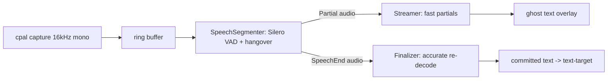

# ASR integration

How speech gets from the microphone to text in this codebase, why each model
was chosen, what its licence means for us, and how to add a backend.

## Architecture: two-stage, streaming-first

M0 measured the OS integration at ~47ms of an 800ms end-to-end budget. The
remaining ~750ms belongs to the recognizer, and the research
(`../outloud-voice-research/02-local-asr-tech.md` §2, §5) says the winning shape
is two recognizers, not one:



- **`crates/audio`** owns everything up to and including the segmenter:
  capture, resample-to-16k, ring buffer, VAD, and the state machine that emits
  `SpeechStart` / `Partial` / `SpeechEnd` events.
- **`crates/asr`** owns recognition. The core trait is
  `Recognizer { feed(&[f32]) -> Option<Partial>, finalize() -> Transcript }`,
  and `TwoStagePipeline` composes any streamer with any finalizer behind that
  same trait, so callers never learn which engines are inside.

The arbitration rule is structural: the finalizer's transcript **replaces**
the last partial wholesale. The pipeline never merges hypotheses, because
merging is where duplicated and dropped words come from (backlog R-06).

## Latency budget breakdown (of the recognizer's ~750ms)

| Stage | Budget | Grounding |
|---|---|---|
| Capture + resample + ring | ~0 (continuous) | measured trivial |
| VAD decision granularity | 30ms/frame | Silero frame size |
| Speech onset -> first partial | ≤ 250ms | Moonshine 73-107ms incremental + chunking (R-05) |
| Partial update cadence | ≤ 150ms | R-05 |
| Endpoint hangover | 300ms | R-02, research §5 |
| Endpoint -> final transcript | ≤ 200ms, and it is a floor not a rate | Parakeet RTFx 30-60 on M-series (R-03); whisper measured flat, below |
| Speech end -> committed text | ≤ 550ms | 300 + 200 + 50 slack |

These constants are also in code (`asr::pipeline::budget`) so instrumentation
can compare measured numbers against them.

One correction from measurement, because the phrasing above misled once
already. "≤ 200ms for 5s audio" implies finalize scales with utterance
length. For whisper it does not: the encoder always processes a padded 30s
window, so the same base.en model finalizes 2.53s of audio in 203-211ms and
7.19s in 247ms (`investigations/whisper-spike.md`). Realtime factor
therefore flatters long utterances and slanders short ones, and the number
to hold a backend to is the floor, not the ratio. Parakeet's chunked encoder
is expected to behave differently; measure it rather than assuming either
shape.

## Backends

| Backend | Role | Status | WER class | Streaming | Platforms |
|---|---|---|---|---|---|
| `MockRecognizer` | tests/CI | done | n/a (deterministic) | yes | all |
| Apple SpeechTranscriber | zero-install finalizer (+partials) on macOS 26+ | **working, measured** | unpublished, subjectively strong | volatile results | macOS 26+ |
| Parakeet TDT 0.6b v2 (ONNX) | primary cross-platform finalizer | stub + model registry entry | 6.05% Open-ASR avg | chunked | all (via ONNX Runtime) |
| whisper.cpp | multilingual fallback finalizer, and the only recognizer off macOS | **implemented** behind `--features whisper` | 7.3-10% by size | pseudo only | all |
| Moonshine / sherpa-onnx Zipformer | streamer tier | planned (M1 weeks 9-12) | 6.65-8% | native | all |

### Apple SpeechTranscriber: measured results (this machine, macOS 26.5, 2026-07)

The backend runs a small Swift helper (`crates/asr/helper/transcriber.swift`,
build: `swiftc -O transcriber.swift -o outloud-speech-helper`) speaking raw
f32le PCM on stdin and NDJSON events on stdout. Measured with
`say`-synthesized audio:

- Helper spawn to analyzer-ready: **60-220ms** (model already installed).
- 2.5s utterance ("the quick brown fox..."): exact transcription with
  punctuation, **~560ms wall including process spawn**.
- 12s three-sentence input at real-time pacing: per-sentence finals, tail
  final **~0.9s after end of input**.
- The live `cargo test -p asr -- --ignored` round trip (synthesize, spawn,
  feed, finalize, assert text) completes in **1.12s**.
- Volatile partials stream progressively **only with `.fastResults`** in the
  transcriber's reportingOptions. Without it the OS batches every hypothesis
  and releases all of them ~10ms apart *after* end-of-input (measured: 17
  partials at t=4.79s for a 4.7s utterance fed at real-time pace), which the
  user experiences as a frozen overlay followed by the whole sentence at
  once. With `.fastResults` the same audio yields the first partial at
  ~1.4s and further waves every ~1.2s during speech. The helper sets it;
  do not remove it.

Model assets are downloaded and owned by the OS (`AssetInventory`): zero app
download, model RAM charged to the system.

## Running with whisper.cpp

The only recognizer that works off macOS. Apple's `SpeechTranscriber` is
macOS-only, so on Windows and Linux this is what makes dictation possible at
all.

Off by default because `whisper-rs` builds whisper.cpp from source, which
needs cmake and a C++ toolchain. Turning it on by default would break
`cargo build` for contributors who only want to typecheck.

```bash
# 1. Build with the backend (needs cmake).
cargo build --release -p outloud --features whisper

# 2. Get a ggml model. base.en is 142MiB and the fastest useful one.
curl -L -o ggml-base.en.bin \
  https://huggingface.co/ggerganov/whisper.cpp/resolve/main/ggml-base.en.bin

# 3. Point the daemon at it.
OUTLOUD_WHISPER_MODEL=$PWD/ggml-base.en.bin outloud --asr whisper
```

Measured on an M4 Pro with `ggml-base.en.bin`, transcribing a 4.96s recording:

| Backend | release->text | Realtime factor |
|---|---|---|
| whisper.cpp base.en | 222-233ms | ~21x |
| Apple SpeechTranscriber | ~300ms | — |

whisper being faster here is not a general claim: base.en is the smallest
useful model, and Apple's recognizer streams partials that whisper cannot
produce. Larger whisper models trade latency for accuracy (small.en roughly
150-300ms on this hardware, large-v3-turbo 8-15x realtime).

### Windows

Verified on Windows 11, Ryzen 9 9950X3D, RTX 5090. Four prerequisites, three
of which fail in ways that do not name themselves:

| Need | Why | Failure if missing |
|---|---|---|
| cmake | builds whisper.cpp | `is cmake not installed?` |
| LLVM | bindgen parses the C headers | `Unable to find libclang` |
| MSVC Build Tools | cmake needs `cl.exe` | `CMakeTestCCompiler` failure |
| CUDA Toolkit | GPU acceleration | builds fine, then runs 25x slower |

```powershell
winget install LLVM.LLVM
winget install Nvidia.CUDA          # NVIDIA; see below for other GPUs

# cl.exe is not on PATH by default, and cmake needs it.
cmd /c 'call "C:\Program Files (x86)\Microsoft Visual Studio\2022\BuildTools\Common7\Tools\VsDevCmd.bat" -arch=amd64 && ^
  set "LIBCLANG_PATH=C:\Program Files\LLVM\bin" && ^
  cargo build --release -p outloud --features whisper-cuda'
```

Quote the `set`: `LIBCLANG_PATH` contains a space, and an unquoted assignment
truncates it at `Program`, after which bindgen reports libclang as missing
even though it is installed.

**Do not skip the GPU feature.** whisper-rs enables Metal automatically on
macOS and nothing anywhere else, so a plain `--features whisper` build is
CPU-only. The same 4.96s utterance on the same machine:

| Build | release->text |
|---|---|
| `--features whisper` (CPU) | **8970ms** |
| `--features whisper-cuda` | **346-364ms** |

Nine seconds is unusable regardless of transcript quality, and nothing in the
output says the GPU is idle. `whisper-vulkan` exists for AMD and Intel; it did
not build here, and CUDA is the better choice on NVIDIA anyway.

Whisper's encoder takes a fixed 30-second window. Longer utterances are
truncated at the START of the audio, with a line on stderr saying so, because
a transcript that begins mid-thought reads as a recognition failure rather
than a length limit.

### Linux

There is no zero-install recognizer on Linux: Apple's `SpeechTranscriber` is
macOS-only, so whisper.cpp is not the fallback here, it is the *only* option,
and `--asr whisper` is the default (see `DEFAULT_ASR` in
`crates/outloud/src/main.rs`).

Two ways to get a build, in increasing order of reproducibility:

**1. Plain cargo**, same shape as macOS/Windows:

```bash
cargo build --release -p outloud --features whisper        # CPU
cargo build --release -p outloud --features whisper-cuda    # NVIDIA
```

Needs cmake, a C++ toolchain, and (CPU only) `pkg-config` + ALSA dev headers
for `cpal`. For `whisper-cuda`, additionally the CUDA toolkit (`nvcc` on
`PATH`) and libclang for bindgen, same requirement as Windows above and for
the same reason: `whisper-rs-sys`'s build script shells out to both. Link
step needs `libcuda`, `cudart`, `cublas`, `cublasLt`, `culibos` findable
under `/usr/local/cuda/lib64` or `/opt/cuda/lib64` (see
`whisper-rs-sys`'s `build.rs`); a distro CUDA install normally puts them
there.

**2. The nix flake**, which is what was actually exercised end to end (see
below for exactly how much):

```bash
nix build .#default        # CPU, no whisper feature at all, matches every other platform's default
nix build .#outloud-cuda    # NVIDIA CUDA, x86_64-linux only
```

`outloud-cuda` is a SEPARATE flake package output, not a flag on `default`.
Reasons are in `flake.nix`'s own comments, in short: CUDA is unfree and
multi-gigabyte and `nixpkgs.config` is a single global knob per `pkgs`
instantiation, so folding it into the default output would mean either that
config bleeding into every other package this flake builds, or a tangle of
conditionals not worth the alternative. It mirrors nixpkgs' own
`pkgs/by-name/wh/whisper-cpp/package.nix` CUDA recipe (the only build in
nixpkgs solving exactly this problem, and the one nixpkgs CI actually
exercises): `cudaPackages.backendStdenv` (CUDA imposes an upper bound on the
host gcc version that whisper-rs's own `cmake` crate does not enforce),
`cuda_nvcc` + `bindgenHook` + `autoAddDriverRunpath` to build, `cccl` +
`cuda_cudart` + `libcublas` to link.

**What was actually verified, and what was not.** This was built on macOS,
where `nix build` cannot produce an x86_64-linux binary at all without a
remote Linux builder, which was not available. What WAS verified, on this
Mac, against the real toolchain versions the flake resolves:

- `nix build .#default` (the CPU/no-whisper package every platform shares)
  really builds, sandboxed, on this machine -- proving the flake restructure
  needed to add `outloud-cuda` did not disturb the existing reproducibility
  check.
- `nix eval .#packages.x86_64-linux.outloud-cuda` evaluates to a real
  derivation with no errors, and `nix derivation show` on it was inspected
  directly (not just eyeballed as "looks right") to confirm: the CUDA
  `cargoBuildFeatures` env var whisper-rs actually reads is `outloud/whisper-cuda`
  (caught one bug here: `cargoBuildFeatures =` as a `buildRustPackage`
  argument is silently accepted and does nothing, because that name is the
  internal derived env var, not the argument -- `buildFeatures =` is), the
  `stdenv` bound is genuinely `cudaPackages.backendStdenv` and not the plain
  one (compared store hashes), and `nativeBuildInputs`/`buildInputs` contain
  exactly the libraries `whisper-rs-sys`'s `build.rs` links against.
- The `--features whisper` CPU path itself (not the nix packaging around it,
  the actual whisper.cpp compile-link-run) was verified for real, but on
  macOS with cmake fetched from the nix store rather than Homebrew: built
  `-p asr --features whisper`, ran `cargo test -p asr --features whisper`
  against the real `ggml-base.en.bin`, both passed, including the
  integration test that transcribes the committed audio fixture. This
  proves whisper-rs's cmake+bindgen build path itself works when its
  prerequisites are present; it does not prove anything CUDA-specific, since
  this Mac has no NVIDIA GPU and Metal is what actually ran.

**What is NOT verified and needs the real machine (NixOS, RTX 5090):**

1. `nix build .#outloud-cuda` actually completing -- nvcc compiling the real
   `.cu` kernels, the final link against `libcuda`/`cudart`/`cublas`
   succeeding, no missing dependency surfacing only at link time (a category
   of failure `nix derivation show` cannot catch, since it only inspects
   declared inputs, not what the C++ toolchain actually resolves).
2. The binary running at all: does `outloud --asr whisper` on the produced
   `outloud-cuda` binary load a model and transcribe, on real hardware, with
   the real driver's `libcuda.so` (which Nix cannot vendor -- CUDA's own
   documentation is explicit that the driver's user-mode libraries come from
   the host driver install, never from the redistributable toolkit
   packages)?
3. Whether it is actually accelerated -- the CPU-vs-CUDA latency gap
   Windows measured (8970ms vs 346-364ms) is the number this build exists to
   reproduce on Linux, and nothing here measures it.
4. Model discovery on a real fresh Linux install: `--asr whisper` finding
   a model fetched via `asr::models::fetch` into `~/.outloud/models`
   (fixed in `crates/outloud/src/main.rs`'s `discover_whisper_model`,
   verified end to end on macOS with the real model file, but never
   exercised through a nix-built binary on Linux).

## Model and licence audit

The app is MIT. Code licences below are all MIT-compatible. Model *weights*
are separate artifacts fetched at runtime into `~/.outloud/models`, never
vendored into this repository, so weight licences constrain distribution of
downloaded bundles, not this codebase.

| Component | Code licence | Weight licence | MIT-compatible? |
|---|---|---|---|
| cpal | Apache-2.0 | n/a | yes |
| Silero VAD | MIT | MIT | yes |
| vad-rs (optional) | MIT | n/a | yes |
| Apple SpeechTranscriber | proprietary OS framework | OS-managed | yes to *use*: OS API, nothing shipped |
| whisper.cpp / whisper-rs | MIT | MIT (ggml conversions of OpenAI weights) | yes |
| Parakeet TDT 0.6b v2 | NeMo Apache-2.0 / export tooling | **CC-BY-4.0** | yes with attribution; keep as download, show attribution in About |
| Moonshine (future) | MIT | MIT (check per-model card) | yes |
| sherpa-onnx (future) | Apache-2.0 | per-model | yes |

Rule of thumb enforced by `asr::models::ModelSpec`: every registry entry
carries its weight licence, and anything non-MIT must remain download-only.

## Model manager

`asr::models::fetch` downloads with HTTP Range resume, verifies SHA256 over
the whole file (including any resumed prefix), and renames atomically into
the cache only after verification, so a present file is always a verified
file. Progress reporting is bytes-done / bytes-total when the server sends a
length, bytes-done only when it does not. Checksums not yet pinned are
downloaded with a loud warning that prints the actual hash for pinning.

## Benchmark methodology

What we measure, and how, so numbers stay comparable:

1. **Synthetic first.** `say -o x.aiff "<text>"` then
   `afconvert -f caff -d LEF32@16000 -c 1` produces deterministic 16kHz f32
   input. Feed it at real-time pace (200ms chunks, 200ms sleeps) to measure
   streaming behaviour, or all at once to measure batch RTF.
2. **Timestamps at the consumer.** Latency is measured where the caller sees
   the event (helper stdout line arrival, `feed` return), not inside the
   engine, because the user experiences the whole pipe.
3. **Report three numbers per backend:** ready time (spawn/load to
   accepting audio), first-partial latency from speech onset, and
   finalize time from end-of-input. Plus RSS.
4. **WER comes later** (R-07): the fixed 30-minute test set and `eval` crate
   land in M1; do not quote ad-hoc WER numbers from synthetic audio.

## Adding a new backend

1. Create `crates/asr/src/backends/<name>.rs` and implement `Recognizer`.
   Batch engines buffer in `feed` and work in `finalize`; streaming engines
   return `Partial`s from `feed`. Both are first-class.
2. Whole-hypothesis semantics: each `Partial` *replaces* the previous one.
   Never emit deltas.
3. `finalize` must reset all state so the instance is reusable for the next
   utterance, and must be the only place errors surface.
4. If the engine needs weights, add a `ModelSpec` to `asr::models::registry`
   with URL, approximate size, weight licence, and (once fetched and
   verified) a pinned SHA256.
5. Native-library dependencies (ONNX Runtime, whisper.cpp) go behind a cargo
   feature so the default build stays dependency-light and CI-green.
6. Wire it into `TwoStagePipeline` at the call site: that is a constructor
   argument, and by design nothing else changes.
