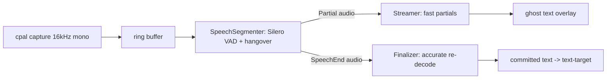

# ASR integration

How speech gets from the microphone to text in this codebase, why each model
was chosen, what its licence means for us, and how to add a backend.

## Architecture: two-stage, streaming-first

M0 measured the OS integration at ~47ms of an 800ms end-to-end budget. The
remaining ~750ms belongs to the recognizer, and the research
(`../aqua-voice-research/02-local-asr-tech.md` §2, §5) says the winning shape
is two recognizers, not one:

- **`crates/audio`** owns everything up to and including the segmenter:
  capture, resample-to-16k, ring buffer, VAD, and the state machine that emits
  `SpeechStart` / `Partial` / `SpeechEnd` events.
- **`crates/asr`** owns recognition. The core trait is
  `Recognizer { feed(&[f32]) -> Option<Partial>, finalize() -> Transcript }`,
  and `TwoStagePipeline` composes any streamer with any finalizer behind that
  same trait, so callers never learn which engines are inside.

The arbitration rule is structural: the finalizer's transcript **replaces**
the last partial wholesale. The pipeline never merges hypotheses, because
merging is where duplicated and dropped words come from (backlog R-06).

## Latency budget breakdown (of the recognizer's ~750ms)

| Stage | Budget | Grounding |
|---|---|---|
| Capture + resample + ring | ~0 (continuous) | measured trivial |
| VAD decision granularity | 30ms/frame | Silero frame size |
| Speech onset -> first partial | ≤ 250ms | Moonshine 73-107ms incremental + chunking (R-05) |
| Partial update cadence | ≤ 150ms | R-05 |
| Endpoint hangover | 300ms | R-02, research §5 |
| Endpoint -> final transcript | ≤ 200ms for 5s audio | Parakeet RTFx 30-60 on M-series (R-03) |
| Speech end -> committed text | ≤ 550ms | 300 + 200 + 50 slack |

These constants are also in code (`asr::pipeline::budget`) so instrumentation
can compare measured numbers against them.

## Backends

| Backend | Role | Status | WER class | Streaming | Platforms |
|---|---|---|---|---|---|
| `MockRecognizer` | tests/CI | done | n/a (deterministic) | yes | all |
| Apple SpeechTranscriber | zero-install finalizer (+partials) on macOS 26+ | **working, measured** | unpublished, subjectively strong | volatile results | macOS 26+ |
| Parakeet TDT 0.6b v2 (ONNX) | primary cross-platform finalizer | stub + model registry entry | 6.05% Open-ASR avg | chunked | all (via ONNX Runtime) |
| whisper.cpp | multilingual fallback finalizer | stub + model registry entry | 7.3-10% by size | pseudo only | all |
| Moonshine / sherpa-onnx Zipformer | streamer tier | planned (M1 weeks 9-12) | 6.65-8% | native | all |

### Apple SpeechTranscriber: measured results (this machine, macOS 26.5, 2026-07)

The backend runs a small Swift helper (`crates/asr/helper/transcriber.swift`,
build: `swiftc -O transcriber.swift -o aqua-speech-helper`) speaking raw
f32le PCM on stdin and NDJSON events on stdout. Measured with
`say`-synthesized audio:

- Helper spawn to analyzer-ready: **60-220ms** (model already installed).
- 2.5s utterance ("the quick brown fox..."): exact transcription with
  punctuation, **~560ms wall including process spawn**.
- 12s three-sentence input at real-time pacing: per-sentence finals, tail
  final **~0.9s after end of input**.
- The live `cargo test -p asr -- --ignored` round trip (synthesize, spawn,
  feed, finalize, assert text) completes in **1.12s**.
- Honest caveat: volatile partials arrived in bursts at sentence boundaries
  on TTS audio rather than word-by-word. Until verified against natural
  microphone speech, treat SpeechTranscriber as a zero-install *finalizer*
  and plan the streamer slot for Moonshine/Zipformer.

Model assets are downloaded and owned by the OS (`AssetInventory`): zero app
download, model RAM charged to the system.

## Model and licence audit

The app is MIT. Code licences below are all MIT-compatible. Model *weights*
are separate artifacts fetched at runtime into `~/.aqua-oss/models`, never
vendored into this repository, so weight licences constrain distribution of
downloaded bundles, not this codebase.

| Component | Code licence | Weight licence | MIT-compatible? |
|---|---|---|---|
| cpal | Apache-2.0 | n/a | yes |
| Silero VAD | MIT | MIT | yes |
| vad-rs (optional) | MIT | n/a | yes |
| Apple SpeechTranscriber | proprietary OS framework | OS-managed | yes to *use*: OS API, nothing shipped |
| whisper.cpp / whisper-rs | MIT | MIT (ggml conversions of OpenAI weights) | yes |
| Parakeet TDT 0.6b v2 | NeMo Apache-2.0 / export tooling | **CC-BY-4.0** | yes with attribution; keep as download, show attribution in About |
| Moonshine (future) | MIT | MIT (check per-model card) | yes |
| sherpa-onnx (future) | Apache-2.0 | per-model | yes |

Rule of thumb enforced by `asr::models::ModelSpec`: every registry entry
carries its weight licence, and anything non-MIT must remain download-only.

## Model manager

`asr::models::fetch` downloads with HTTP Range resume, verifies SHA256 over
the whole file (including any resumed prefix), and renames atomically into
the cache only after verification, so a present file is always a verified
file. Progress reporting is bytes-done / bytes-total when the server sends a
length, bytes-done only when it does not. Checksums not yet pinned are
downloaded with a loud warning that prints the actual hash for pinning.

## Benchmark methodology

What we measure, and how, so numbers stay comparable:

1. **Synthetic first.** `say -o x.aiff "<text>"` then
   `afconvert -f caff -d LEF32@16000 -c 1` produces deterministic 16kHz f32
   input. Feed it at real-time pace (200ms chunks, 200ms sleeps) to measure
   streaming behaviour, or all at once to measure batch RTF.
2. **Timestamps at the consumer.** Latency is measured where the caller sees
   the event (helper stdout line arrival, `feed` return), not inside the
   engine, because the user experiences the whole pipe.
3. **Report three numbers per backend:** ready time (spawn/load to
   accepting audio), first-partial latency from speech onset, and
   finalize time from end-of-input. Plus RSS.
4. **WER comes later** (R-07): the fixed 30-minute test set and `eval` crate
   land in M1; do not quote ad-hoc WER numbers from synthetic audio.

## Adding a new backend

1. Create `crates/asr/src/backends/<name>.rs` and implement `Recognizer`.
   Batch engines buffer in `feed` and work in `finalize`; streaming engines
   return `Partial`s from `feed`. Both are first-class.
2. Whole-hypothesis semantics: each `Partial` *replaces* the previous one.
   Never emit deltas.
3. `finalize` must reset all state so the instance is reusable for the next
   utterance, and must be the only place errors surface.
4. If the engine needs weights, add a `ModelSpec` to `asr::models::registry`
   with URL, approximate size, weight licence, and (once fetched and
   verified) a pinned SHA256.
5. Native-library dependencies (ONNX Runtime, whisper.cpp) go behind a cargo
   feature so the default build stays dependency-light and CI-green.
6. Wire it into `TwoStagePipeline` at the call site: that is a constructor
   argument, and by design nothing else changes.
