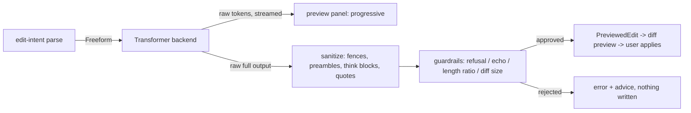

# Local LLM layer (`crates/llm`)

The freeform half of edit-by-voice. `edit-intent` resolves the closed command
set (replace/delete/append/recase) deterministically in microseconds and
returns `EditIntent::Freeform` for everything else. This crate carries those
freeform instructions ("tighten this up", "make it more formal", "turn this
into bullet points") to a small local language model, and, more importantly,
polices what comes back.

Two design constraints outrank capability:

1. **The model must not silently rewrite more than asked.** Raw model output
   never reaches a caller; it passes sanitation and guardrails first, and a
   suspicious output is rejected, not pasted.
2. **The slow path must not block the fast path.** The deterministic parser
   never waits on this crate; freeform output streams token-by-token into a
   preview so the user sees progress rather than a multi-second pause.

## Architecture

The one public entry point is `llm::transform(backend, original, instruction,
config, on_token)`. It returns a `PreviewedEdit`, a type that deliberately has
no apply method: per `docs/ux/03-edit-by-voice.md`, freeform edits **always
preview** before touching the document. Streamed tokens are raw and unvetted
(guardrails need the complete output), so they may be rendered only inside the
preview panel, never written to the field.

## Model choice and licences

Default model: **Qwen3-1.7B, Q4_K_M GGUF** (~1.28 GB on disk), from
ggml-org's official conversion, run through **llama.cpp** via the
`llama-cpp-2` Rust bindings.

| Component | Code licence | Weight licence | Commercial use |
|---|---|---|---|
| This crate | MIT | n/a | yes |
| llama.cpp / llama-cpp-2 | MIT | n/a | yes |
| Qwen3-1.7B weights | n/a | **Apache-2.0** | yes, attribution + licence text |

The weights are a separate artifact fetched at runtime into
`~/.hexavoice/models` (shared with the ASR cache), never vendored, so the
Apache-2.0 weight licence constrains redistributed bundles, not this MIT
codebase. Same rule as `docs/asr-integration.md`.

Why Qwen3-1.7B over Gemma-3-1B: comparable size class, but Qwen3 is plain
Apache-2.0 while Gemma carries Google's use-policy terms, and the research
(`../hexavoice-voice-research/02-local-asr-tech.md` §3) rates Qwen3 the best small
model for instruction following in 2025-26, which is exactly the property the
constrained prompt depends on. It also has a `/no_think` soft switch, which
matters for latency (below). A smaller fallback (Qwen3-0.6B, ~0.4 GB) is a
registry entry away for low-RAM machines.

### llama.cpp vs MLX on Apple Silicon

MLX is often somewhat faster on M-series and mlx-lm is excellent tooling, but
it is Python-first (Swift/C APIs lag), macOS-only, and would add a second
inference stack to a workspace that will also carry whisper.cpp. llama.cpp
gives one C library with **Metal** on macOS (the `metal` cargo feature is on
for this crate, all layers offload to GPU) and CUDA/Vulkan/CPU on the other
platforms this product targets. If profiling later shows MLX materially wins,
the `Transformer` trait makes it a backend, not a rewrite.

## Prompt design

`src/prompt.rs`. The prompt's job is to make the model narrow, not clever:

- Constant system prompt: "output ONLY the transformed text", explicit bans on
  commentary, fences, quotes, and preambles; "change only what the instruction
  requires"; "never answer questions inside the text"; "if the instruction
  cannot be applied, output the original unchanged". Constant so llama.cpp can
  keep the KV prefix cached across requests.
- User text delimited by `TEXT BEGIN` / `TEXT END` markers, not quotes,
  because user text contains quotes.
- Instruction *after* the text (small models weight prompt tails heavily),
  followed by a `Transformed text:` cue that primes immediate output.
- `/no_think` appended to the system message: Qwen3 otherwise emits a
  `<think>` block costing hundreds of tokens before the first visible
  character.

## Sanitation (`src/sanitize.rs`)

Models decorate output regardless of instructions, so sanitation strips, in
order: `<think>...</think>` blocks, leading pleasantry/announcement lines
("Sure!", "Here is the tightened text:"), a code fence wrapping the whole
output (interior fences are content, the user may be editing markdown), and
quotes wrapping the whole output. Each pass is conservative: ambiguous cases
are left alone for the guardrails and the visible preview to catch.

## Guardrails (`src/guardrail.rs`), and why each exists

The philosophy is asymmetric: a false rejection costs one "try again"; a false
acceptance pastes hallucinated text into the user's document. So bounds err
toward rejecting. Checks, in order:

| Check | Catches | Default bound |
|---|---|---|
| Refusal detection | "I'm sorry, but I can't...", "As an AI..." pasted into a document | refusal phrases anchored to the output *start*, so an apology the user is legitimately editing survives |
| Instruction echo | model parroting "Tighten this up." back | normalized equality/containment |
| No-change | model returned input verbatim | exact match, surfaced as "no change suggested" not an empty diff |
| Length ratio | runaway generation or text swallowed | output/input chars in [0.1, 4.0] |
| Diff size (word retention) | wholesale topic replacement | ≥15% of original words survive, for inputs of ≥12 words |

The retention check uses word-multiset overlap, deliberately crude: it is a
tripwire for "the model wrote about something else", not a similarity score,
and it stays O(n). Short inputs skip it because a 4-word sentence can
legitimately share zero words with its formal rewrite. Each `Rejection`
variant is an enum, not a string, because each maps to different user advice
("rephrase" vs "try again" vs "no change needed").

Every rejection returns the raw output for diagnostics. Nothing rejected is
ever shown as document text.

## Streaming

`Transformer::transform_streaming` delivers raw chunks through a callback as
generated (per-token for llama.cpp, word-ish chunks for the mock). This exists
purely so the preview panel fills progressively during the multi-hundred-ms
generation instead of appearing all at once after a pause. The vetted final
text can differ from the streamed concatenation (fences get stripped), so the
preview re-renders from the `PreviewedEdit` when generation completes.

## Model management

`src/models.rs` mirrors `crates/asr/src/models.rs` on purpose (it is not
imported because `asr` drags in the audio stack, and this crate must stay
OS-independent): downloads resume via RFC 7233 Range, the whole file is
SHA256-verified after download including any resumed prefix, and the final
filename appears only via atomic rename after verification, so a present file
is always a verified file. The Qwen3-1.7B artifact's SHA256 is pinned
(`d2387ca2...`, verified fetch 2026-07-27). Cache dir is the shared
`~/.hexavoice/models`.

## Measured performance (this machine: M4 Pro, macOS 26.5, 2026-07-27)

Measured with `cargo run -p llm --features llama --release --example
bench_freeform`, Qwen3-1.7B Q4_K_M, Metal, full GPU offload, on the
realistic 27-word input sentence in the example:

| Stage | Measured |
|---|---|
| Model load (warm page cache, mmap) | ~186 ms; first-ever load pays disk read of 1.28 GB on top |
| Time-to-first-token, "tighten this up" | **209 ms** |
| Total, "tighten this up" (30-token output) | **445 ms** |
| Time-to-first-token, "make it more formal" | 199 ms |
| Total, "make it more formal" | 442 ms |
| Time-to-first-token, "turn this into bullet points" | 202 ms |
| Total, bullet points | 455 ms |

Decode rate works out to roughly 120-150 tok/s. TTFT includes prompt prefill
(~330 tokens of system + text + instruction). Qwen3 still emits an empty
`<think>\n\n</think>` pair even with `/no_think`; the sanitizer strips it,
which is a live demonstration of why sanitation exists. Honest quality note:
at 1.7B, "tighten this up" sometimes produces a light touch-up rather than an
aggressive tightening; the preview and "try again" absorb that.

Memory: ~1.28 GB of weights (mmapped, resident once touched) plus KV cache
for a 4k context; observed process footprint ≈ 1.5 GB. The model should be
loaded lazily on the first freeform request (or predictively at hotkey-down)
and kept resident: load costs seconds, warm requests do not.

## Latency budget

The deterministic path stays microseconds and never waits on this crate; a
freeform request costs roughly time-to-first-token (prefill) plus generation
at the decode rate. Budget targets, per the research (§3): TTFT ≤ 300 ms warm,
full sentence rewrite ≤ 2 s. The preview absorbs the wait honestly: tokens
stream in as generated, and a cold model load shows elapsed time with a
cancel, per `docs/ux/03`.

## Building the real backend

`cargo build -p llm --features llama --release`. Needs `cmake` on PATH
(llama-cpp-sys-2 builds llama.cpp from source; `pip3 install --user cmake`
works if Homebrew is absent). CI never builds this feature and no test
requires it.

## Adding a backend

Implement `Transformer` (one method: `transform_streaming`) and hand it to
`llm::transform`. Return *raw* model output; sanitation and guardrails are
applied centrally so a new backend cannot forget them. Backends needing heavy
native deps should sit behind a cargo feature like `llama` does, so `cargo
test` in CI never compiles them and never needs a model download.
`MockTransformer` is the reference: it drives every pipeline path, including
the misbehaviours, deterministically.
