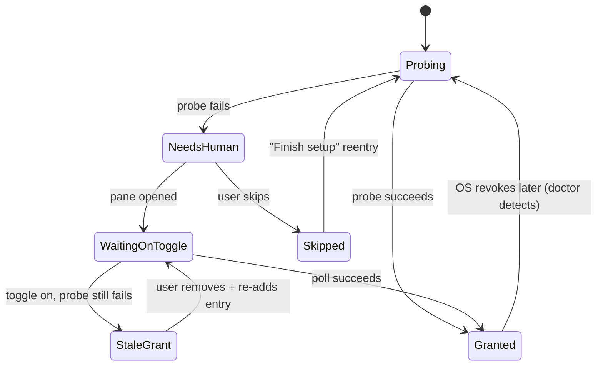

# Onboarding: the permission gauntlet and the first model

Onboarding is where system-wide input tools die. The product needs OS
permissions that are deliberately un-grantable by software, on three operating
systems with three different failure shapes, followed by a multi-gigabyte model
download on a network we know nothing about. This document designs that
gauntlet as a first-class feature.

The governing rule, from `docs/macos-permissions.md`: **verify every grant,
never assume it.** On macOS specifically, the permission toggle can read "on"
while every call fails (wrong responsible process, or a stale `cdhash` after a
rebuild). A flow that trusts the toggle will strand users in a state that looks
granted and behaves broken, which reads as "this app doesn't work."

## Structure: a checklist that proves itself

First run opens the one and only wizard the product will ever show. It is a
linear checklist where every item has three states, and the state is determined
by *probing*, not by whether the user clicked our button:

```
+--------------------------------------------------------------+
|  Set up voice input                                     1/3  |
|                                                              |
|  [x] Microphone            verified - heard audio            |
|  [~] Accessibility         waiting for you to toggle it on   |
|  [ ] Voice model           2.1 GB download, not started      |
|                                                              |
|  macOS needs you to allow this in System Settings.           |
|  We opened the right pane. Toggle on "AquaOSS".              |
|                                                              |
|  This permission lets the app read and rewrite text in       |
|  the field you're editing. It is checked live: this line     |
|  turns green the moment the toggle works, with no restart.   |
|                                                              |
|                             [ Open pane again ]  [ Skip > ]  |
+--------------------------------------------------------------+
```

Design rules for the checklist:

- **Each item is a probe, not a record.** "Microphone: verified" means we
  opened the device and measured non-silence. "Accessibility: verified" means
  a real `AXIsProcessTrusted` + a live read of a scratch field succeeded, not
  that the settings toggle looks on. The wizard polls (1s interval) while its
  window is frontmost, so success is detected the instant the user flips the
  toggle, no "restart the app" step ever.
- **One permission per screen-moment.** Never send the user to System
  Settings for two things at once. Each grant gets its plain-language
  *why* (one sentence, in terms of user benefit, not API names).
- **Every item is skippable, and skipping is honest.** Skipping Accessibility
  yields a working dictation tool with paste-only insertion and no
  edit-by-voice. The wizard says exactly that at skip time, and the tray menu
  carries a persistent "Finish setup (1 item)" entry, not a nag.
- **The wizard is re-enterable forever.** `Tray → Setup checkup` (and
  `aqua doctor` in a terminal) re-runs every probe and shows the same
  checklist. Permissions get revoked behind our back (OS updates, TCC resets,
  re-signs); the recovery flow *is* the onboarding flow, so it stays tested.

## macOS: the brutal one

What M0 proved, and how the flow absorbs each finding:

| Finding | Flow consequence |
|---|---|
| Grant follows the *responsible process*: a binary run from a shell is judged by the terminal's permission | The shipping app is always launched via LaunchServices, so users never hit this. `aqua doctor` detects the case anyway (trusted-check fails while the toggle is on and the responsible process is a terminal) and says: "You're running this from a terminal, which macOS treats as the terminal asking for permission. Launch the app normally, or grant your terminal Accessibility." |
| Grant is pinned to `cdhash`; re-sign silently revokes while the toggle reads "on" | Ship with a Developer ID cert from the first external build so grants pin to the team ID. If the probe fails while the toggle reads on, the flow says: "macOS is holding a stale approval. Remove AquaOSS from the list, then re-add it" with a button to the pane. Never let the user stare at an on-toggle that doesn't work. |
| `-25204` means "not trusted", not "busy" | Error mapping happens in `ax-edit`; onboarding renders `NotTrusted` as the Accessibility checklist item flipping back to unverified, with the pane-opening button. Raw codes appear only in `aqua doctor --verbose`. |
| AX calls can hang on a busy target | All probes are time-bounded (500ms). A timeout during verification retries against our own scratch window, never against a third-party app, so verification can't be poisoned by someone else's hung Electron process. |

Microphone TCC is comparatively kind (a real prompt we can trigger), but it is
still verified by capturing and measuring, because "granted but wrong input
device selected" is a real state. The mic step shows a live level meter and
asks the user to say anything; hearing yourself move the meter is both the
verification and the first moment of delight.

Input-monitoring permission (for the global hotkey via CGEventTap) is its own
checklist item on macOS where required, probed the same way: register the tap,
synthesize nothing, just confirm the tap reports enabled.

## Windows

- **Microphone**: Settings → Privacy toggle can be off machine-wide or
  per-app. Same probe (capture + level meter). If capture fails, deep-link
  `ms-settings:privacy-microphone` and poll.
- **No UAC by default.** The app installs and runs per-user. The one case that
  needs elevation is injecting into elevated windows (an admin terminal):
  detect it at use-time, not install-time, and offer "Restart AquaOSS
  elevated for this session" rather than demanding admin up front.
- **SmartScreen** is onboarding before our onboarding: an unsigned binary gets
  a scare screen that ends most installs. Code-signing cert is a launch
  blocker, same reasoning as Developer ID on macOS.
- UIAutomation needs no grant, so Windows users get the shortest checklist:
  mic, hotkey test, model. Say so: "Windows setup: 2 steps."

## Linux

Two worlds, detected automatically and shown honestly:

- **X11**: global hotkey and injection both work. Checklist mirrors Windows.
- **Wayland**: there is no portable global-hotkey or injection protocol. The
  probe sequence tries, in order: the `GlobalShortcuts` xdg-desktop-portal,
  compositor-specific IPC (Hyprland, Sway), `zwp_input_method_v2` for
  injection, and falls back to evdev (needs `input` group membership) plus
  wl-clipboard paste. The checklist shows *which tier this compositor
  reached*:

```
[x] Microphone          verified
[x] Hotkey              via GNOME global shortcuts portal
[~] Text injection      paste-only on this compositor
    In-place editing needs an input-method protocol your
    compositor doesn't expose. Dictation works; edits will
    go through the clipboard.            [ Details ]
```

Honesty about the Wayland ceiling is a principle-3 trust surface. We never
show a broken "verified" on a tier we didn't reach.

## Verification finale: the golden test

The last checklist item after permissions and before the model finishes is a
live end-to-end test *inside the wizard*, in a real text field we own:

```
+--------------------------------------------------------------+
|  Try it                                                      |
|                                                              |
|  Hold [Right Option] and say: "the quick brown fox"          |
|                                                              |
|  +--------------------------------------------------+        |
|  | the quick brown fox|                              |        |
|  +--------------------------------------------------+        |
|                                                              |
|  47ms field access + 210ms recognition. You're set.          |
|                                                              |
|  Now select "quick", hold the key, and say                   |
|  "change quick to slow".                                     |
|                                                              |
|                                          [ Finish ]          |
+--------------------------------------------------------------+
```

This does three jobs at once: proves the whole pipeline (hotkey, mic, model,
injection) with the user watching, teaches the two core gestures (dictate,
edit) by doing rather than reading, and shows the measured latency so the
performance story lands on day one.

## First-run model download

Multi-GB, on an unknown network, with the app useless until at least one model
exists. Rules:

- **Start the download the moment the wizard opens**, in parallel with the
  permission steps. Permissions take the user 1–3 minutes of fumbling in
  System Settings; a good connection finishes the small model in that window
  and the user never waits on a bare progress bar.
- **Tiered models, small first.** Download the small/fast tier (a few hundred
  MB) first and unlock dictation as soon as it lands. The large accurate tier
  continues in the background and hot-swaps in when ready, with a single
  passive note in the tray. The user dictates minutes after install, not
  after 2.1 GB.
- **Resumable and verifiable, always.** HTTP range resume, chunk checksums,
  atomic rename on completion. Quit, sleep, network drop: reopening shows the
  bar where it left off. A corrupted download re-fetches only bad chunks.
- The progress UI shows size, rate, and ETA, and offers **Pause** and
  **"I'm on a metered connection"** (which pauses the large tier and keeps
  only the small one until told otherwise). Detect OS metered hints where
  available and ask rather than assume.
- **Sideload path for airgapped machines**: "Download on another computer"
  shows a plain URL + `sha256`, and the model folder accepts a dropped file.
  This is a real audience for a local-first tool, treat it as a doorway, not
  an easter egg.
- This is the product's only network activity, and the wizard says so right
  on the download row: "Models are the only thing this app ever downloads.
  Audio never leaves this computer."

## Failure and recovery map



Every state names its exit. No state says "error". The wizard's last screen for
a partially-skipped setup lists exactly which capabilities are off and the one
menu item that resumes.
