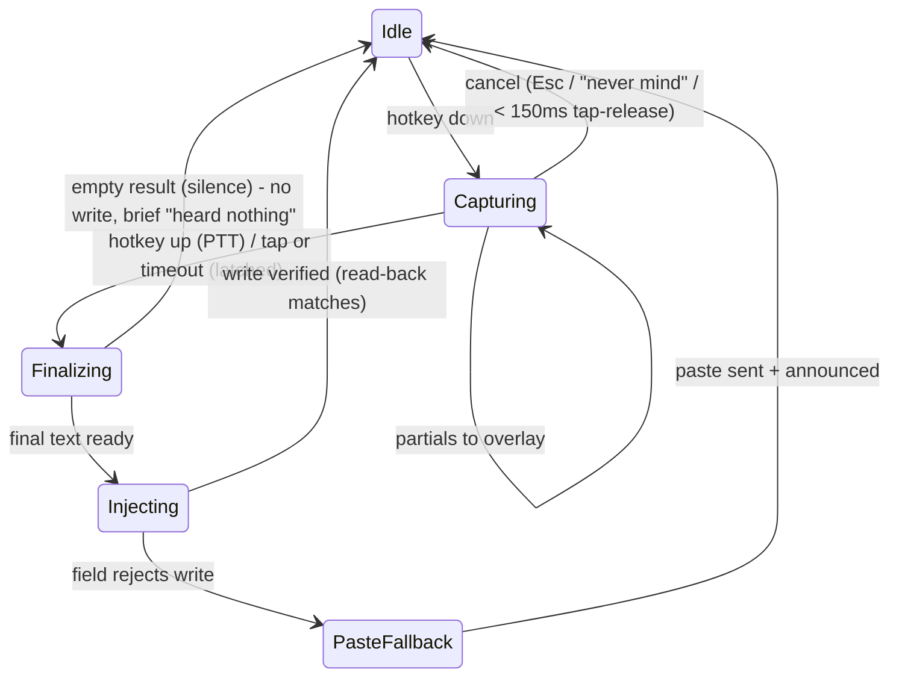

# Core interaction: activation, the overlay, and getting text in

This is the interaction the user performs hundreds of times a day. Every
decision here is judged by principle 2 (latency is the UX) and principle 1
(invisible by default).

## Activation: push-to-talk wins, the others are modes for a reason

Three candidate models, one default:

**Push-to-talk (hold to speak) is the default.** It is the right default
because it makes the microphone state *physically embodied*: the mic is hot
exactly while a finger is down. No mode to forget, no trailing capture, no
voice-activated false triggers in a meeting. It also gives us a free, natural
commit signal (key-up), which the insertion model below leans on. Aqua and
Wispr both default to hold-to-talk; users arriving from either carry the habit.

**Toggle (tap to start, tap to stop)** is offered for long-form dictation and
is *essential* for motor-impaired users who cannot sustain a hold
(see `06-accessibility.md`). Tap-vs-hold is disambiguated on the same key:
press-and-release under 300ms toggles, hold beyond 300ms is push-to-talk. Both
work with zero configuration, and the overlay shows which mode it's in
(`● holding` vs `● latched — tap again or say "stop listening"`). In latched
mode a hard silence timeout (default 60s, configurable) is a safety net against
the forgotten hot mic.

**Voice activation ("hey aqua") is off by default** and lives behind settings.
An always-on microphone contradicts the trust story (principle 3) badly enough
that it must be an explicit, informed opt-in with a persistent tray badge while
armed. It exists because zero-keyboard operation requires it
(`06-accessibility.md`), not because it is a good general default.

### Hotkey selection and conflict detection

- Default: **Right Option (macOS) / Right Ctrl (Windows/Linux)**. Bare
  modifiers don't collide with app shortcuts, are reachable one-handed, and
  holding a modifier alone is otherwise meaningless, so PTT steals nothing.
  Aqua's Fn default is unavailable to third parties reliably enough; we don't
  copy it.
- The picker is *press-to-set*: focus the field, press the desired key or
  chord, done. F13–F19 and multi-key chords supported for keyboards that have
  them; foot pedals and Bluetooth buttons register as keys and just work.
- **Conflict detection is active, not a list.** On selection we check: OS
  reserved chords (media keys, Spotlight, input-source switch), our own other
  bindings, and, where the platform allows, whether the chord is registered by
  a running app. Findings are advisory with severity: "Cmd+Space is Spotlight
  on this Mac. Pick it anyway?" Never silently accept a dead key.
- At runtime, if the hotkey tap stops receiving events (macOS disables event
  taps under load, another app grabs the key), the tray glyph flips to the
  warning state and the menu names it: "Hotkey stopped responding.
  [Re-register]". A dictation tool whose key silently dies is indistinguishable
  from a broken product, so this failure is loud.

## The overlay

### What it is

A small, focus-less, click-through-except-buttons panel. On macOS it is a
non-activating panel (`NSPanel` with `nonactivatingPanel`), on Windows a
`WS_EX_NOACTIVATE | WS_EX_TOPMOST` window, on Wayland a layer-shell surface
where available. **It never takes keyboard focus.** The user's caret stays in
their app, blinking, the whole time. Any design that requires clicking the
overlay for the core loop is rejected; its buttons exist only for the
mouse-preferring minority and every one has a voice/key equivalent.

### Where it appears

Anchored **near the text caret** when the focused element exposes caret bounds
(AX on macOS, UIA on Windows), offset below-right, flipping above when near
the screen edge. Caret-anchoring keeps the feedback in the user's existing
locus of attention, which is the whole point. When caret bounds are
unavailable (many Electron apps, games, terminals without support), it falls
back to a fixed position: bottom-center of the active display, where it
overlaps the fewest things people read. The fallback position is user-movable
by drag, remembered per display. In terminals we prefer in-band indicators
over the overlay entirely (`04-terminal-and-headless.md`).

### What it shows

```
   key-down                 while speaking                after release
+-------------+   +----------------------------------+   +-----------
| ●           |   | ▁▂▅▂▁  and then we should prob…  |   | (gone -
+-------------+   +----------------------------------+   |  text is
                                                         |  in the app)
```

- **State glyph** (●): red while capturing, amber while transcribing after
  release, spinner during a freeform-LLM edit. This is the microphone truth
  indicator (principle 3) and is never omitted.
- **Live waveform** (▁▂▅▂▁): cheap amplitude bars. Its job is answering "is it
  hearing me?" within 100ms of key-down, before any model output exists. A
  flat line while speaking is instant, legible diagnosis of a mic problem.
- **Partial text tail**: the last ~60 chars of the current hypothesis, single
  line, middle-truncated from the left. Not the full transcript; the app's
  own field is the source of truth once text commits.
- **Latency, on demand**: hovering (or `aqua doctor`) shows the per-stage
  numbers (read / recognize / write). Not shown by default; measured always.

The overlay appears on key-down within one frame and vanishes at commit. Its
death animation is under 100ms. Nothing about it persists on screen after the
interaction, per principle 1.

## Getting text in: streaming vs commit-on-release

Two insertion strategies exist because destinations differ (README: three
rewrite strategies, best first). The *user-facing* model is one thing: text
lands where the caret is. Under it:

**Commit-on-release is the default.** Audio streams to the recognizer during
the hold, partials render *in the overlay only*, and exactly one finalized,
punctuated, formatted string is written to the app at key-up. One write, one
undo entry, no mid-stream flicker in the user's document. With the recognizer
running during the hold, the finalize cost at release is small (the M0 budget:
~47ms OS + final-pass tail), so commit-on-release does not feel batch, it
feels instant.

**Streaming insertion is opt-in per destination** (and the default in Realtime
long-form latched mode, where watching a silent field for 90 seconds is
worse). Rules that keep partials from feeling like flickering garbage:

1. **Commit horizon.** Only text the recognizer has finalized (stable across N
   consecutive hypotheses, roughly one phrase behind the audio) is written to
   the app. The unstable tail lives in the overlay, styled dim. The app never
   shows a word that will later be retracted, revision churn is confined to
   the overlay where dimming marks it as provisional.
2. **Append-only writes into the app.** If a *committed* word does turn out
   wrong, we do not rewrite it mid-stream; the final pass at the end applies
   one consolidated correction diff. Users tolerate one visible settle at the
   end; they do not tolerate words rewriting themselves as they read along.
3. **Write coalescing.** Injected writes batch on a ~80ms tick, word-granular,
   so the field updates at a readable cadence instead of per-token stutter.
4. **Fields that only support `AXValue` full rewrites never get streaming.**
   Rewriting the whole value per tick destroys caret position and undo.
   Strategy detection (`TextSnapshot::strategy()`) gates this automatically;
   such fields silently use commit-on-release even if streaming is on.

## Undo semantics

The platform facts (README, M0): writing `AXSelectedText` goes through the
app's own text system, so **host undo keeps working**. Writing `AXValue`
**resets the host application's undo stack**. Paste fallback is a normal paste
and undoes normally.

Design consequences:

- **Prefer the strategy that preserves host undo**, always, even when
  marginally slower. `set-selected-text` first, `AXValue` only when the field
  refuses, paste as last resort. Undo integrity outranks 10ms.
- **The product keeps its own undo stack regardless** (the client-side stack
  the M0 plan calls for): a ring of `(field identity, before, after, caret)`
  snapshots for our last N mutations per app. "undo that" spoken, or the tray
  menu's "Undo last dictation", restores the before-image through the same
  write path. This is what makes edits stackable (`03-edit-by-voice.md`) and
  it is the only undo that works after an `AXValue` write nuked the host's.
- **Cmd+Z must not betray.** In `AXValue` destinations, host Cmd+Z after our
  write does nothing (stack was reset) rather than something wrong, which is
  survivable but must be recoverable: our own undo covers it. If the field
  content changed under us since our write (user typed), our undo refuses the
  blind restore and offers the before-text on the clipboard instead:
  "The field changed since that dictation. Copied the previous version."
  Never blindly stomp user keystrokes with a stale snapshot.
- One dictation = one undo unit. Streaming mode's many small writes are
  coalesced into a single unit in *our* stack, and grouped via the host's
  undo-grouping API where one exists.

## Interaction state machine (core loop only)



Cancellation is first-class: Esc during capture, or an accidental sub-150ms
key blip, discards audio without writing anything and without ceremony. The
full product state machine, including permission and model states, lives in
`05-settings-and-states.md`.
