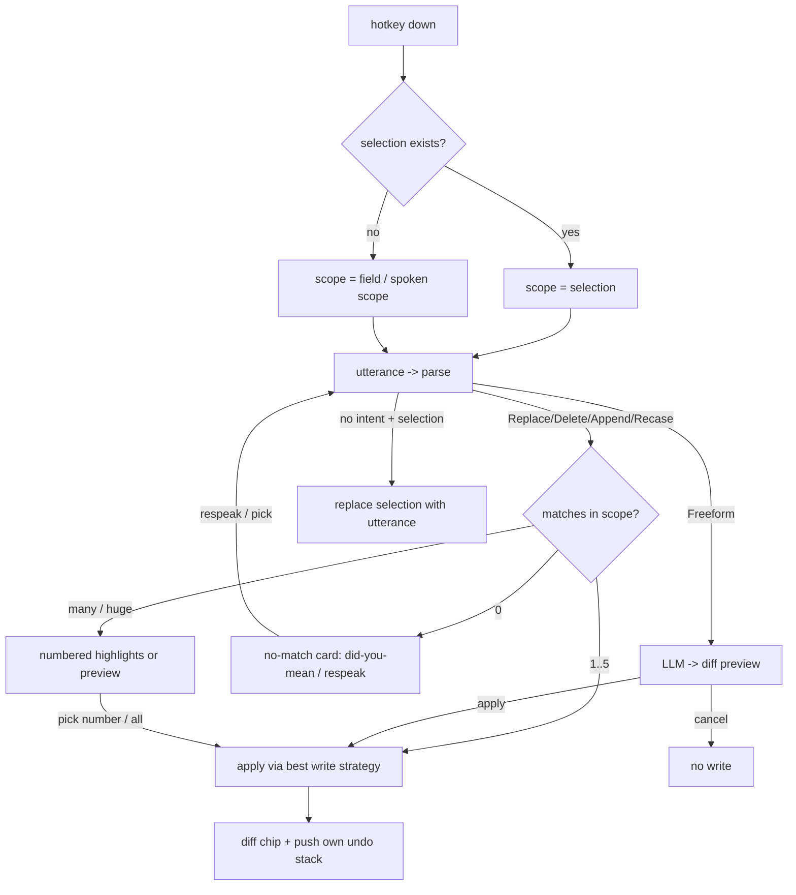

# Edit-by-voice

This is the capability no open-source tool has (README), the reason M0 exists,
and the feature this product is judged on. The design problem splits into four:
how the user targets text, how they discover what they can say, what happens
when a command is ambiguous or matches nothing, and when we preview versus
apply-with-undo.

Grounding: the intent layer is the `EditIntent` enum in
`crates/edit-intent/src/lib.rs`:

```rust
pub enum EditIntent {
    Replace { from: String, to: String },  // "change X to Y"
    Delete  { text: String },              // "delete X"
    Append  { text: String },              // "add X"
    Recase(Case),                          // Upper | Lower | Title | Sentence
    DeleteScope(Scope),                    // "delete the last sentence"
    Scoped { scope, intent },              // "in the last sentence, change X to Y"
    Punctuate { mark, anchor },            // "add a period at the end"
    DeleteMark { mark, which },            // "remove the last comma"
    Wrap { open, close },                  // "wrap this in quotes"
    Identifier(IdentCase),                 // "make it snake case"
    ListOp(ListOp),                        // "number these lines"
    Undo(UndoDepth),                       // "undo that"
    Freeform { instruction: String },      // escalates to a local LLM
}
```

Every deterministic intent is microsecond-cheap and cannot hallucinate
(measured p50 0.92us parse+apply; see
`docs/investigations/edit-intent-scope.md`). `Freeform` is the only intent
that involves a model. That asymmetry drives the whole UX:
**deterministic intents apply instantly with undo; freeform edits preview.**

`Undo` is the one deterministic intent with no text transformation: the undo
ring owns the previous states, so `apply` returns `None` and delivery routes
on the variant. That is what makes "undo that" stop being read as a request
to delete every occurrence of the word "that".

## Targeting: what does the edit act on?

Same gesture as dictation: hold the key, speak. What changes is the target,
resolved in priority order:

1. **Explicit selection.** If the focused field has a selection when the key
   goes down, the edit scope is exactly that selection. This is the power-user
   path and matches OutLoud's Edit Mode gesture (select, hold, speak), so
   switchers keep their habit. Selecting *is* disambiguation: "delete this" on
   a selection needs no search text at all.
2. **No selection: the search text scopes it.** "change quick to slow" with no
   selection operates on the whole field (M0's `scope: whole field`), because
   `Replace`/`Delete` carry their own target in `from`/`text`. This is what
   makes edit-by-voice usable *without touching the mouse*, which matters
   enormously for the accessibility audience (`06-accessibility.md`).
3. **Spoken scope narrowing** for large fields: "in the last sentence, change
   its to it's", "delete the last sentence", "make the first line title case".
   Scope phrases (`last/first/this sentence|line|paragraph|word`) are parsed
   ahead of the intent and constrain the search window. Unscoped commands on
   very large fields (over ~2k words) are automatically scoped to the visible
   region ± one paragraph, because "delete the" against a whole document is a
   footgun no one intends.

There is deliberately **no command prefix word**. OutLoud's Edit Mode uses no
command words; a raw utterance while text is selected is treated as a
replacement dictation ("just say the corrected version"). We adopt that rule
with one correction, described below. Selection + utterance that *does* parse
("make this title case") = the edit. The escape hatch for dictating text that
sounds like a command is the prefix "type: change hello to goodbye".

### The correction: an unparsed utterance is not automatically a replacement

"Selection + no parse = replace the selection with the utterance" is wrong for
half its traffic, and the wrong half is destructive. Live, in TextEdit:

```text
before: "The customers might possibly be quite upset about this."
spoke:  "tighten this up"
after:  "Tighten this up."      <- the sentence is gone
```

The user's paragraph was replaced by the words describing what they wanted
done to it, reported as success. The opposite default is also a real failure:
text is selected far more often than people realise (a terminal keeps the last
drag highlighted, editors select the current word, browsers hold a selection
long after the click), so refusing every unparsed utterance made ordinary
dictation write nothing, which reads as "the app stopped transcribing".

Both readings are legitimate, so the rule is now a **classification**, in
`crates/outloud/src/freeform.rs`:

| Utterance, with a selection live | Read as | Behaviour |
|---|---|---|
| Parses as a deterministic command | edit | apply it, flash the diff chip |
| Opens with a rewrite verb aimed at the selection ("tighten this up", "fix the grammar") | instruction | **write nothing**, show the Error overlay naming what was heard |
| Anything else ("we should tell them soon", "fix the login bug and add tests") | dictation | insert it, replacing the selection as typing would |
| Prefixed "type: ..." | literal dictation | insert the words verbatim, prefix removed |

One further guard, on scale rather than wording: inserting a dictated phrase
*replaces* the selection, so a handful of words landing on a very large
selection is a deletion even when the wording was read correctly. That case is
refused too, for the same reason this section's table exists. Verified live:
the same utterance correctly replaced a 55-character sentence and left a
2239-character document byte-for-byte unchanged.

The classifier is deliberately biased, because **a wrong refusal costs the
user one retry; a wrong overwrite costs them their paragraph, silently.**
Measured on an adversarial corpus (`cargo run -p outloud --example
freeform_stress`): **0/15 destructive misses, 2/19 false refusals.** The
refusal message names the `type:` retry, so a false refusal is a speed bump
rather than a dead end.

Until the preview panel below exists, the "instruction" row is where every
freeform edit lands. When it ships, that row previews instead of refusing;
the classification that gets it there does not change.

## Discoverability: the hard problem for voice

A voice interface has no menus to scan. Users cannot discover "swap X for Y"
by hovering. Three mechanisms, layered by user maturity:

**1. Teach at the moment of correction.** The highest-signal moment is right
after a user manually fixes something we could have fixed by voice. If a user
selects a word we just dictated and retypes it, the *next* dictation overlay
appends one dim hint line, once: `tip: you can say "change teh to the"`. Rate
limited to one tip a day per command shape, permanently silenceable, and
never delivered as a notification. This is how the four verbs actually enter a
user's vocabulary.

**2. The cheat sheet is one gesture away, always.** Holding the hotkey and
saying "what can I say" (or tapping `?` on the overlay) shows a card, rendered
against the *current context*:

```
+------------------------------------------------------+
|  While holding the key, say things like:             |
|                                                      |
|  change  <this> to <that>       replace              |
|  delete  <words>                remove them          |
|  add     <words>                append to the end    |
|  make it all caps / title case  recase               |
|  "in the last sentence, ..."    narrow the scope     |
|  undo that                      revert last edit     |
|                                                      |
|  Anything else gets sent to the local model:         |
|  "tighten this up", "make it more formal"            |
|  (those show a preview first)                        |
|                                                      |
|  Selected text? Just speak the corrected version.    |
+------------------------------------------------------+
```

The card is generated from the parser's own grammar table, so it can never
drift from what the parser accepts. Synonym heads ("replace/swap/get rid of/
scratch") appear on the card's expanded view, not the summary.

**3. Failed commands teach.** Every `Freeform` escalation and every no-match
is a discovery opportunity; see below. The error path is the tutorial.

## Disambiguation

### Match count is the branch

`apply()` already returns `None` when the search text is absent, precisely so
"the caller can tell the user the command did not match instead of silently
doing nothing" (lib.rs). The UX completes that contract:

**Zero matches.** Never silently do nothing, never guess. The overlay stays up
one beat with the specific miss and the two most likely next actions:

```
| "recieve" isn't in this field.                        |
|   Did you mean:  receive  ·  received                 |
|   say "one" / "two", or re-speak the command          |
```

The did-you-mean candidates come from fuzzy search over the field (edit
distance ≤ 2, honoring the case-insensitive matching the parser already does,
since ASR casing never matches the screen). If nothing is close, the message
is just the miss plus `say "show commands" for help`. No-match costs the user
one glance and zero writes.

**One match: apply immediately.** No confirmation. This is the 90% case and
it must feel like the M0 demo: spoken → changed, ~50ms after final
recognition. Confirmation theater here would destroy the feature
(principle 2). Safety comes from undo, not from asking.

**Multiple matches.** `Replace`/`Delete` are defined as "every occurrence"
(lib.rs), and for 2–3 occurrences of a typo that is almost always what the
user wants, so: **apply to all, and say what happened** in the overlay's
commit flash: `replaced 3 × "teh"`. The count is the disambiguation. If the
user meant one, "undo that" then "change the second teh to the" (ordinal
scoping) recovers in one breath. Above a threshold (>5 matches, or matches
inside a spoken narrow scope conflicting with matches outside), we downgrade
to a highlight-and-choose: occurrences flash numbered highlights via AX
bounds, "say a number, or 'all'". Ordinals ("the second one", "the last one")
work in every disambiguation prompt.

### Ambiguous parses

The deterministic grammar is prefix-anchored, so true parse ambiguity is rare
by construction (the "change to do to to-do" case is handled by last-joiner
splitting in the parser, not by asking the user). When the parse succeeds but
the result would be destructive and enormous (delete matching >30% of the
field), we treat scale itself as ambiguity and show the preview flow below.

## Preview vs apply-with-undo

The rule: **determinism decides.**

| Intent class | Behavior | Why |
|---|---|---|
| Every deterministic intent | Apply instantly, flash a diff chip, rely on undo | Outcome is exactly predictable from the command; asking adds latency and zero information |
| `Freeform` (LLM) | Preview before write | A model can produce anything; writing unvetted generated text into the user's document violates trust (principle 3) |
| Any intent whose blast radius is huge (see above) | Preview | Scale converts a safe edit into a risky one |

### The apply path (deterministic)

The write happens through the best strategy (`03` of README), then the overlay
shows a **diff chip** for ~1.5s, which is the entire confirmation UI:

```
|  quick → slow          undo: say "undo that" or ⌘⌥Z  |
```

Stackable undo: every applied edit pushes onto the product's own undo ring
(`02-core-interaction.md`), because `AXValue` writes reset host undo and the
client must keep its own (M0 next-steps #5). "undo that" pops one; "go back to
the original" rewinds the whole stack for that field. Both phrases work while
holding the key, matching OutLoud's stackable-undo behavior head-on.

### The preview path (freeform)

Freeform costs LLM latency anyway (hundreds of ms to seconds), so a preview
adds relatively little and buys correctness review where it is actually
needed:

```
+------------------------------------------------------+
|  "tighten this up"                        local LLM  |
|                                                      |
|  - It is really quite important that we should       |
|  -   try to make sure the deploy happens today.      |
|  + The deploy must happen today.                     |
|                                                      |
|  say "apply" · "try again" · "never mind"            |
|  [Apply ⏎]                [Retry]        [Cancel ⎋]  |
+------------------------------------------------------+
```

- Voice-first controls, key and button equivalents always present.
- "try again" re-runs with the same instruction (sampling differs); "try
  again, but keep the first sentence" appends refinement to the instruction.
- The preview panel is the one overlay variant that can accept keys (Enter/
  Esc), but only while it is showing, and Esc always means cancel-and-write-
  nothing.
- If the model is still loading (cold start), the panel says so with elapsed
  time and offers cancel, per principle 4. Freeform being temporarily
  unavailable (model not downloaded) degrades to an honest message naming the
  fix: "Open-ended edits need the language model. [Download 1.1 GB]".

## Edit flow, end to end



## What we refuse to build

- **No edit macros or scripting language in v1.** Talon owns that niche; our
  users want the four verbs plus freeform to be flawless.
- **No auto-applied freeform.** However good the model gets, generated text
  always previews. This line is what lets us say "the model never touches
  your text without you seeing it first", which is a sentence OutLoud cannot say
  about a cloud pipeline.
- **No modal "edit mode" the user enters and exits.** One gesture; the
  selection state and the utterance determine everything. Modes rot.
