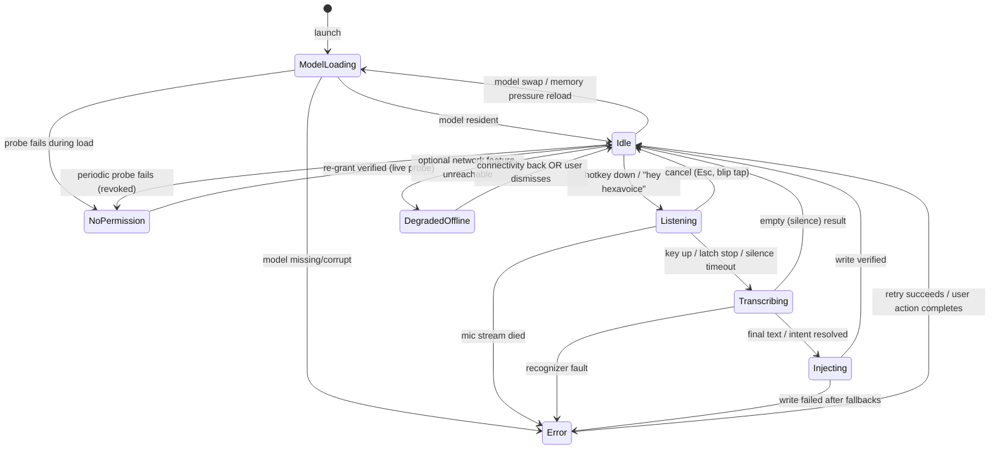

# Settings and states

Two halves: the complete product state machine (what the engine is doing and
what the user sees for each state), and the settings information architecture
(what is surfaced, what is buried, and why).

## The state machine

One machine, shared by every rendering surface: the GUI overlay + tray glyph,
the OSC cursor color, the tmux widget, the TUI header, and `hexavoice status
--json` all render the *same* state enum. There is deliberately no
surface-specific state, which is what keeps the terminal experience honest.



No absorbing states: `Error` and `NoPermission` always carry a named exit
(principle 4).

### State-by-state contract

For each state: what every surface shows, and what the user can do. The glyph
column is the tray icon (GUI) and the cursor/status color (terminal).

| State | Glyph | Overlay / terminal | User actions |
|---|---|---|---|
| `idle` | quiet monochrome | nothing (invisible-by-default) | hotkey, tray menu, CLI |
| `listening` | red dot | waveform + partial tail; red cursor via OSC | speak, Esc to cancel |
| `transcribing` | amber | "…" with elapsed ms if > 400ms | wait (sub-second), Esc discards |
| `injecting` | amber | nothing (it's ~13-47ms, per M0); paste-fallback announces itself | none needed |
| `error` | red badge | one line: situation → action button | the named action, or dismiss |
| `no-permission` | gray + slash | tray menu top item: "Accessibility revoked. [Re-grant…]" | re-enter the onboarding probe flow |
| `model-loading` | pulsing | tray: "Loading model… 4s"; hotkey during load queues a **buffered capture**: audio records now, transcribes when ready, overlay says "will transcribe in ~3s" | dictate anyway (buffered), switch to smaller model |
| `degraded-offline` | quiet + tiny dot | nothing proactive; settings shows "update check unreachable" | nothing required, core is unaffected |

Two deliberate choices worth defending:

- **`model-loading` does not block the hotkey.** Recording is cheap and local;
  audio buffers while the model pages in, so a dictation begun 2 seconds after
  login is captured, not lost. Losing the user's words because we were slow
  is the worst possible first impression.
- **`degraded-offline` is almost invisible** because offline is a supported
  condition, not an incident (principle 3). It exists as a state only so
  update-check failures never render as errors.

`no-permission` is entered from a *periodic lightweight probe* (and on every
failed real call), because macOS revokes silently (TCC reset, re-sign, OS
update). Detecting it in the background, before the user's next dictation
fails, converts a mid-flow betrayal into a calm tray notice.

## Settings IA

Doctrine: **defaults must be excellent; the first screen must fit on one
screen; everything else is buried behind "Advanced" with search.** A settings
window is where invisible utilities go to die of accretion, so every setting
must justify surface placement by expected-use frequency, not by how proud we
are of the feature.

### Surfaced (the one screen)

```
+  Settings ────────────────────────────────────────────+
|                                                       |
|  Hotkey            [ Right Option        ] [change]   |
|  Microphone        [ MacBook Pro Mic   ▾ ]  ▁▂▅▂▁     |
|  Language          [ Auto-detect        ▾ ]           |
|  Model             [ Balanced (1.1 GB)  ▾ ]           |
|                     Fast · Balanced · Accurate        |
|                                                       |
|  Insertion         (•) Insert when I release          |
|                    ( ) Stream words as I speak        |
|                                                       |
|  Privacy           Network requests since launch: 0   |
|                    History: [on ▾]  [Open folder…]    |
|                                                       |
|  Vocabulary…       App profiles…       Advanced…      |
+───────────────────────────────────────────────────────+
```

The live network counter and the plain history folder are settings-as-proof
(principle 3): claims a user can check, not copy a marketing page.

### Buried (Advanced, searchable)

Voice activation ("hey hexavoice") and its arming rules, "run it / send it" for
terminals, silence timeout, overlay position and hide, per-stage latency
display, streaming commit-horizon tuning, model storage location, telemetry
(**off by default**, and the toggle shows exactly what a payload would
contain), launch-at-login, and the entire diagnostic toolbox (`doctor`
output, log locations). Every advanced setting has a `hexavoice set` key with the
same name, so docs and support answers are copy-pasteable on all platforms.

### Per-application profiles

Profiles answer "the right output differs by destination" without making the
user think about it. A profile = matcher (bundle id / exe name / window
class, plus the terminal-tier detector) → overrides:

- **Formatting**: casing style (casual-lowercase for Slack/Discord/iMessage),
  trailing punctuation, smart quotes, list formatting.
- **Vocabulary bias**: which dictionaries are active (code terms in editors
  and terminals, medical dictionary in the EHR, none in the password field —
  and secure fields are *never* captured into history regardless).
- **Insertion**: force commit-on-release (some apps handle streaming badly),
  force paste fallback for known-broken AX implementations. These ship as
  maintained defaults in a public quirks list; users can override.
- **Enable/disable**: mute the tool entirely in chosen apps (games, DAWs).

Ship with ~10 built-in profiles (terminals, Slack-class chat, code editors,
email, browsers) that users can inspect and edit, so the feature teaches
itself by example. Creating a profile starts from "current app" with one
click: `App profiles… → [+ Frontmost app]`.

### Vocabulary and dictionary management

The dictionary is a competitive front: Hexavoice caps free users at 5 entries and
Pro at 800. Ours is unlimited and plain-text, and that is a feature we say
out loud.

- **Format**: UTF-8 text files in a `vocabulary/` folder, one entry per line,
  `spoken form -> written form` (or a bare term for bias-only). Git-able,
  sync-able, shareable. The GUI editor is a convenience view over the files,
  and external edits hot-reload.
- **Three entry types**, one list: bias terms (make the recognizer prefer
  `kubectl`), replacements (`"dash dash force" -> --force`), and
  auto-expansions (`"my address" -> 12 Elm St…`) with per-entry
  preserve-case and strip-punctuation flags.
- **Capture at the point of failure**: the highest-value dictionary entry is
  the word the recognizer just got wrong. After the user corrects a
  transcribed word (manually or by voice edit), the diff chip offers a
  one-key "[+ dictionary]". This, not the settings screen, is where most
  entries should be born.
- **Sets, not one blob**: entries group into named sets (Code, Kubernetes,
  Medical, Team names) toggled per profile. Importable from plain text; we
  publish community sets in a repo rather than building a store.

## Cross-cutting rules

- Every setting change applies live, no restart, and is reflected in
  `hexavoice status --json` immediately, because the TUI/CLI and GUI are equal
  clients (`04-terminal-and-headless.md`).
- Settings live in one human-readable file (`config.toml`) with the GUI as
  editor. Corrupt config → load defaults, keep the broken file as
  `config.toml.broken`, say so in the tray. Never refuse to start over
  config.
- Resetting to defaults is one visible button and it says what it will not
  touch (dictionary, history, models).
