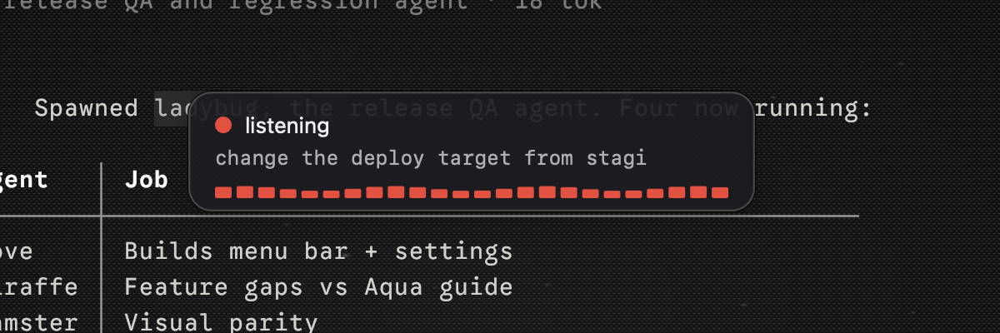
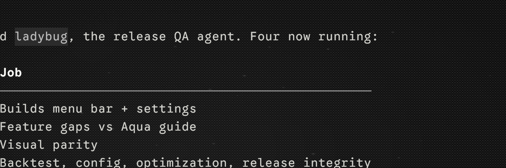
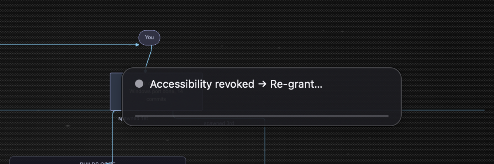

# Visual parity with Aqua Voice

The goal of this document is narrow and concrete: make our surfaces *look*
like Aqua Voice, to the point that someone who used Hexavoice yesterday feels at
home today, while keeping every place where our local-first design should
deliberately diverge.

This is not a feature comparison (see `docs/competitive-analysis.md` for
that) and not an interaction rewrite (see `02-core-interaction.md`). It is
pixels, colours, radii, and timings.

## How the reference was gathered, and its limits

**What I could observe directly** (2026-07-28):

| Source | What it gave |
|---|---|
| `withaqua.com` stylesheet (`/_next/static/css/eefa388e02313efb.css`) | The **exact design tokens**: `.bg-cobalt`, `.bg-ink`, `.bg-hexavoice`, … as literal RGB values, plus the font stack and the radius scale |
| `withaqua.com/images/icons/orb-128.png` | The brand "orb": pixel-sampled its gradient |
| `aquavoice.com/info/faq` | The overlay's **name and appearance in their own words**: *"How do I hide the black floating bar at the bottom? Open Settings → System and toggle off 'Show Floating Bar'."* |
| `aquavoice.com/changelog` | Design-system history: 0.15.1 "Refreshed the desktop app with Hexavoice's updated design system… Updated the loading and sign-in screens with the new Hexavoice orb"; 0.9.5 "Beginnings of a UI refresh"; 0.11.5 "The microphone UI no longer jumps around when recording"; 0.11.9 "Fixed Floating Bar positioning issue when in fullscreen" |
| `aquavoice.com/llms.txt`, `/guide` | Settings section names, mode names (Instant / Realtime), latency figures |
| 9to5Mac press image, App Store listing | Marketing-composited product imagery |

**What I could NOT observe, and am therefore not asserting:**

- The browser bridge in this environment is not connected (the Firefox
  extension is not installed), so I could not drive `withaqua.com`'s
  interactive hero, which is where the animated bar mock lives. Everything
  below comes from static assets, CSS, and their own prose.
- I did not install the Hexavoice macOS app, so I have **no direct screenshot of
  the real Floating Bar or the real settings window**. Their marketing and
  App Store imagery is composited, not a screen capture.
- Consequently: every statement about their *bar's* exact radius, height,
  meter style, and animation timing below is marked **(inferred)**. The
  colour tokens, the "black bar at the bottom" placement, the font stack,
  and the radius scale are **(observed)**.

Anything inferred is a starting value chosen to be consistent with what was
observed, not a measurement. If someone installs Hexavoice later, the inferred
rows are the ones to correct.

## Their visual language (observed)

### Palette, exactly as published

| Token | Hex | Role |
|---|---|---|
| `cobalt` | `#4288FF` | Primary action / "the product is doing something" |
| `hexavoice` | `#67BEFF` | Lighter brand blue |
| `hexavoice-deep` | `#219AF7` | Saturated blue for emphasis on light surfaces |
| `hexavoice-pale` | `#A7DAFC` | Palest blue; reads as "waiting" |
| `ink` | `#292C3D` | Their "black". **Blue-tinted charcoal, not neutral** |
| `ink-soft` | `#3E4150` | Hairlines, inset fills |
| `mist` | `#F4F5F7` | Light surface |
| `frost` | `#FAFAFA` | Lightest surface |

The orb icon's gradient, sampled from `orb-128.png`: `#6CC0FF` at the
lower-left through `#4799FF` at the centre to `#5494FF` at the lower-right.
A soft, low-contrast sphere, not a hard two-stop gradient.

The single most identity-carrying value here is `ink`. It is 20 units bluer
in B than in R. A neutral `#1C1C1E` card, which is what we shipped, reads as
"generic macOS HUD"; `#292C3D` reads as "that blue dictation app".

### Type

`SF Pro Text, Inter, ui-sans-serif, system-ui, -apple-system` for UI text,
`Geist Mono / SFMono-Regular / Menlo` for code. On macOS that resolves to SF
Pro, i.e. the system font. Nothing exotic to match: use
`NSFont::systemFontOfSize`.

### Radii

Their scale, from the stylesheet: `4, 6, 8, 10, 13, 20, 25, 27, 30, 31, 40,
50, 70, 100, 110, 9999`px. Two families: pills (`9999`, and the large fixed
values for round buttons) and cards (`8`–`13`). Buttons are `8`.

### Shadow

Their surface shadow is a stacked six-layer ramp rather than a single drop:

```
0 0 0 1px rgba(0,0,0,.02), 0 1px 1px .5px rgba(0,0,0,.02),
0 3px 3px 1.5px rgba(0,0,0,.02), 0 6px 6px -3px rgba(0,0,0,.02),
0 12px 12px -6px rgba(0,0,0,.02), 0 24px 24px -12px rgba(0,0,0,.02)
```

Plus a blue-tinted glow on primary CTAs: `0 28px 11.38px rgba(73,146,255,.03)`
through `0 1.75px 3.5px rgba(73,146,255,.08)`. AppKit's `setHasShadow(true)`
gives us one layer, not six; the practical port is "keep the system shadow,
add the 1px inner light ring", which is what `theme::CARD_BORDER` is for.

### The overlay itself

Observed: it is called the **Floating Bar**, it is **black**, it sits at the
**bottom** of the screen, and it can be turned off in Settings → System.
Their changelog also tells us it once "jumped around when recording" and had
a fullscreen positioning bug, which means it is a positioned floating window
much like ours, not a screen-edge-docked strip.

Inferred from the above plus their radius/colour scale: a wide, low,
pill-or-large-radius bar in `ink`, with the mic affordance and a compact
level indicator, holding live text in Realtime mode.

## What we render today

Screenshots from `cargo run -p overlay --bin overlay-demo` on this machine,
2026-07-28, captured with `screencapture`:

| State | Screenshot |
|---|---|
| Listening |  |
| Error |  |
| No permission |  |

Reference material for their side, as downloaded:

| What | Image |
|---|---|
| Hexavoice brand orb (`orb-128.png`) |  |
| 9to5Mac press composite |  |

Note honestly: the press composite is marketing art, and the orb is an icon,
not the bar. This is the best "their side" evidence available without
installing their client, and it is *not* a screenshot of the Floating Bar.

Measured from our own code before this change (`macos.rs`, `layout.rs`):

| Property | Our value (before) |
|---|---|
| Card size | 340 x 72 pt |
| Card fill | sRGB 0.11, 0.11, 0.13 @ 0.92 → ≈ `#1C1C21` |
| Card radius | 14 pt |
| Border | none |
| Listening accent | 0.96, 0.26, 0.21 → `#F54236` (**red**) |
| Transcribing accent | 1.0, 0.72, 0.0 → `#FFB800` (amber) |
| Label | system 13pt regular, `#F0F0F5` |
| Partial tail | **monospaced** 12pt, `#BFBFC7` @ 0.9 |
| Meter | 24 bars, 3pt gap, computed bar width, max height 12, radius 1.0 |
| State dot | 10pt circle |
| Screen margin | 12 pt · anchor gap 8 pt |
| Animation | none (no fade; instant show/hide) |

## The deltas, in priority order

**1. The card is the wrong black.** `#1C1C21` is neutral; theirs is
`#292C3D`. This is the cheapest, highest-impact single change: one colour,
and screenshots start reading as the same family. *Fix: `theme::CARD_BG`.*

**2. Listening is red; theirs is blue.** Red is the strongest signal we
have, and we spend it on the most routine state in the product. It also
carries the wrong connotation: red-dot means "screen recorder" on macOS.
Their entire "product is working" register is cobalt. *Fix:
`theme::accent()` — Listening `#4288FF`, Transcribing `#67BEFF`, ModelLoading
`#A7DAFC`, leaving warm hues to the two states that want a human.*

**3. The silhouette is too square.** 340x72 (4.7:1) versus a "bar". Their
own noun is *bar*. *Fix: `layout::OVERLAY_SIZE` → 380x64 (5.9:1), radius 14
→ 18.*

**4. The partial tail is monospaced.** Dictation output is prose destined
for an email or a Slack message. Monospace makes provisional text look like
console output and pushes the whole product into a developer-tool register
Hexavoice carefully avoids. *Fix: `theme::TAIL_MONOSPACE = false`, 12.5pt.*

**5. No fade.** The card blinks in and out. Hexavoice's UI reads as smooth. The
constraint is that the fade cannot cost latency: UX principle 2 wants
visible feedback within ~100ms of key-down. *Fix: `FADE_IN_MS = 90`,
`FADE_OUT_MS = 140` — in by 90ms, so it is inside the budget, out slower
because disappearing is not on the critical path.*

**6. The card has no edge.** A dark card over dark content dissolves. Their
surfaces all carry a light inner ring. *Fix: `theme::CARD_BORDER` =
`rgba(255,255,255,0.10)` at 1pt.*

**7. The meter's bars can reach zero height.** A meter that empties to
nothing is indistinguishable from a crashed meter, and the meter's whole job
is proving the mic is live. *Fix: `METER_MIN_HEIGHT = 3.0`, fully rounded
caps (`radius = width/2`), max height 14.*

**8. The pulse is frame-counted, not time-based.** `tick * 0.15` means the
loading state breathes at a different speed on a 120Hz display than on a
60Hz one. *Fix: `theme::pulsed_accent(state, elapsed_secs)`, 0.6Hz.*

## Proposed values (implemented in `crates/overlay/src/theme.rs`)

Every value below is a real constant in that module, with a unit test.

### Surface

| Property | Value | Constant |
|---|---|---|
| Card fill | `#292C3D` @ alpha 0.92 | `CARD_BG` |
| Card radius | 18.0 pt | `CARD_RADIUS` |
| Card border | `rgba(255,255,255,0.10)`, 1.0 pt | `CARD_BORDER`, `CARD_BORDER_WIDTH` |
| Card padding | 16.0 pt | `CARD_PADDING` |
| Card size | 380 x 64 pt | `layout::OVERLAY_SIZE` |

### Accents

| State | Value | Note |
|---|---|---|
| Listening | `#4288FF` (cobalt) | full strength |
| Transcribing | `#67BEFF` (hexavoice) | one step lighter = progress, not a new condition |
| ModelLoading | `#A7DAFC` (hexavoice-pale) | plus the 0.6Hz pulse |
| Error | `#FF4A3D` (ember) | ours; Hexavoice publishes no failure token |
| NoPermission | `#FFA033` (amber) | ours |
| Idle / Injecting / DegradedOffline | `#3E4150` (ink-soft) | invisible on the overlay; used by the tray glyph |

### Type

| Run | Size | Weight | Colour |
|---|---|---|---|
| State label | 13.0 pt | semibold (`0.3`) | `#F2F3F7` @ 1.0 |
| Partial tail | 12.5 pt | regular (`0.0`) | `#F2F3F7` @ 0.62, **not** monospaced |

`#F2F3F7` rather than pure white: white on a near-black card at 12–13pt
shimmers under subpixel antialiasing.

### Meter

| Property | Value |
|---|---|
| Bar width | 3.0 pt |
| Bar gap | 3.0 pt |
| Bar radius | 1.5 pt (half width, fully rounded) |
| Max height | 14.0 pt |
| Min height | 3.0 pt (never zero) |
| Wobble share | 0.45 of the height |

### Motion

| Property | Value |
|---|---|
| Fade in | 90 ms |
| Fade out | 140 ms |
| Loading pulse | 0.6 Hz, alpha 0.35 ↔ 1.0, **time-based** |

### Menu bar glyph (recommended, for the menu-bar surface)

SF Symbols, at `NSImageSymbolConfiguration(pointSize: 15.0, weight:
.regular, scale: .medium)`. Never a fixed bitmap: menu bar height varies with
the notch and the display scale.

| State | Symbol | Treatment |
|---|---|---|
| Idle | `waveform` | template (inverts with the menu bar) |
| Listening | `waveform` | tinted `#4288FF`, template off |
| Transcribing | `waveform` | tinted `#67BEFF` |
| ModelLoading | `waveform` | template, alpha breathing 0.35↔1.0 @ 0.6Hz |
| NoPermission | `exclamationmark.triangle.fill` | tinted `#FFA033` |
| Error | `waveform.slash` | tinted `#FF4A3D` |
| DegradedOffline | `waveform` | template, **no badge** — core dictation is unaffected, so do not shout |

Idle must carry no badge and no colour. UX principle 1: idle is quiet.

### Settings window (recommended structure)

Hexavoice's own sections, from their guide navigation: General, Keybindings,
Dictionary, Custom Instructions, Replacements, History, Languages, File
Tagging, System.

Ours should take the same *shape* (source-list sidebar left, content right,
`NSSplitViewController`) with our tiers:

```
General · Hotkeys · Dictionary · Custom Instructions · History · Privacy · Advanced
```

| Property | Value |
|---|---|
| Min window | 720 x 520 pt |
| Sidebar width | 200 pt |
| Content gutter | 20 pt |
| Row label column | right-aligned, 180 pt, secondary label colour |

**Privacy is a top-level row and is where we deliberately diverge.** Hexavoice has
no equivalent; ours hosts the live "0 network requests since launch" counter
from UX principle 3. Copying their chrome is the point; copying their
omissions is not.

## Where Hexavoice's choice is worse, and we should not copy it

**Bottom-of-screen placement.** Their bar is at the bottom of the display
regardless of where the user is typing. That puts the feedback outside the
user's locus of attention: to check whether recognition is keeping up, you
have to look away from your own sentence. Our caret anchoring
(`02-core-interaction.md`) is better and we keep it.

We do add `layout::place_bottom_center()` so "bottom centre" is available as
an explicit preference for people migrating from Hexavoice, and as a stable
target for screenshots. It is a free function rather than an `Anchor`
variant on purpose: an `Anchor` describes something the host *discovered*
about the user's attention, while this is a fixed preference that ignores
all of that.

**Opaque black over any content.** A flat dark card is legible but heavy.
The macOS-native answer is `NSVisualEffectView` with `.hudWindow` material
and behind-window blending, which sits gracefully over both light and dark
content. Recommended as a follow-up; the flat `ink` fill is ~90% of the look
and is what ships first.

**Their idle presence.** Not observable without installing, so no claim —
but our rule stands regardless: an idle dictation tool that draws attention
to itself fails principle 1.

## What is implemented, and what is left

Implemented in this pass:

- `crates/overlay/src/theme.rs` — the whole palette, type scale, meter
  geometry, and motion table as pure data with 20 unit tests. No AppKit
  linkage, so `cargo check -p overlay --no-default-features` stays green.
- `crates/overlay/src/layout.rs` — `OVERLAY_SIZE` 380x64 shared by both
  backends, `SCREEN_MARGIN` 12→16, `ANCHOR_GAP` 8→10, and
  `place_bottom_center()`, all tested.

Left, and owned by the macOS overlay/menu-bar work:

- `macos.rs` consuming `theme::*` instead of its inline literals, and
  `layout::OVERLAY_SIZE` instead of its private copy.
- The fade in/out (`FADE_IN_MS` / `FADE_OUT_MS`) — currently no animation
  exists at all.
- The 1pt inner border stroke.
- The SF Symbol glyph table for the status item.
- `NSVisualEffectView` backing, as a follow-up.

`windows.rs` should consume the same `theme` constants for exactly the same
reason: it is the mechanism that stops the two backends from drifting into
two different-looking products.
